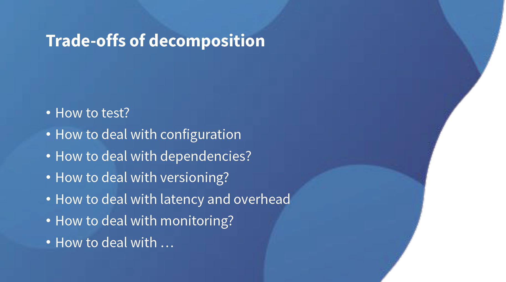

# Are we really cloud-native?

Hand-picked parts from [infoq.com/presentations/cloud-native-intro](https://www.infoq.com/presentations/cloud-native-intro/)

> Kubernetes is the Greek god of spending money on cloud services

There are people wearing this with pride; **there is no cloud, it's just somebody else's computer** at the other end of the Internet. This was **probably true, say, five or more years ago**. That was the state of cloud computing, it was just virtualization, but then taken elsewhere.

## move faster without breaking all the stuff
In order to deal with this new world order that came upon us, with traditional business that needed to evolve and adopt faster, we needed ways to think about how we can move faster without breaking all the stuff that we have around. If you look at most enterprises, they are not like Silicon Valley unicorns which are only interested in doing new stuff, and more new stuff, and even newer stuff. They have their existing business to take into account. They have lots of stuff, which is already there, and which they need to take care of. You cannot just move fast without breaking stuff.

## cohesion over coupling
You can ask, "Are you saying that microservices are a bad idea?" No that's not exactly what I'm trying to convey here, because to me, **microservices are like a modularity tool**. Modularity is always a good thing because it's breaking up bigger structures and smaller things so they are easily solvable. It's hiding the details of implementation, and then connecting stuff together, using some sort of contracts.

> This is the first thing that you'll learn when you start to do software design, cohesion, over coupling. There are a bunch of ways of introducing modularity. Some do it on the code level. If you have a large codebase, then you can start to introduce modularity on the language level. With things like a Java module system, or with OSGI, if you like, you can start to break up a bigger codebase into smaller modules, and then glue them together. When the pace of innovation or the pace of change goes up, you are more confident when you start modifying things over here, that things over there will not break down. Modularity is always a good tool. To me, **microservices is just another level of doing modularity**. If you break up the monolith, if you break up the large codebase into smaller parts, then you need to add that level to do modularity. Microservices to me, in essence, are a modularity tool.

## DevOps & Agile
Another huge problem area is DevOps. DevOps is not new, how can this be a problem area? The thing with DevOps is that there are parallels to draw between DevOps and agile. If you think back in time, when we started doing agile, the whole idea of Agile was really well-received. I think it didn't take us long to understand what it was about. It didn't take us long to understand what the benefits were, and then we started introducing it.

In order to reach a certain amount of maturity with things like agile adoption, it took us quite a few years. This is not because we were stupid as developers; this is because we have this heavy way thing dragging behind our feet, in which we had to transform the organization as well. Agile is only getting some maturity, as soon as you also have some buy-in from business. If you think, "Product owners, who needs them? We can ask the architects," that's probably very stupid thing to do, and that's what we learned over the years. DevOps is basically the same thing. It is not about learning a few new tools or mixing and matching, like some software engineers with some out-of-work DBAs, that's probably not the way to implement DevOps.

The problem with DevOps is dinosaurs - I'm not talking about the DBAs here, by the way - for sure it's called DINO and DINO is DevOps in name only. The thing with that is, dinosaurs are extinct. If you don't want your organization to go extinct, then you have to pay attention to how you implement DevOps.

## What is an App? (2009 Vs 2019)
Whether you're doing microservices or not, if you think about what is an application, if you think about this for a second, you try and come up with an answer, let's say, 10 years ago, let's say the 2009 answer to this. That will probably be, **"An application is like a bunch of code that I have to build and test together. I toss it over the wall to the ops team, and I hope they can get it to run on a bunch of servers that they have provisions.** I hope that there are users trying to use this application so we're not wasting too much dollars on our investment and infrastructure and everything else."

That was a pretty obvious way to do it, but now, **the 2019 answer** would probably be something like this:

> "An application is probably like a mix of a bunch of managed services in the public cloud, connected and customized with our own highly differentiated business logic. Then we glue everything together, which then runs and bills only when needed. When nobody runs it, we pay nothing, and if there are a lot of users, then we pay some more money, but we're probably fine with that because that seems to be like a nice economic scale.

## Cloud-native is transformational journey and getting DevOps right

> Cloud-native in this is some sort of a **DevOps journey** to me.

If you want to be cloud-native, it's not about picking a framework or two. **It is a transformational journey and getting DevOps right**. I'm not sure I'm allowed to say it, but what it actually is about is hooking stuff together, let's call it like that. It's hooking stuff together, because if you want to reap the benefits of the cloud, you really have to know all the services that your cloud provider has to offer. If you want to package some sort of software components with Docker container, and you take the Docker container to your cloud provider, say AWS, then there's at least four or five ways to run Docker containers on AWS. Figuring out which way actually suits that particular application or that particular component, that is what cloud-native is actually about. It's about keeping up with all of the advancements that your cloud provider is actually making, and then try to apply that to your software components.

## Organization Culture is important
Gluing the software and your infrastructure together is something which is not an end state. This is a continuous journey. You keep on improving this with new services seeing the light of day and new components seeing light of day. Because we're microservices; these services could also be short-lived. If the service changes or gets replaced by another service, then maybe the new way of deploying it is different from the old way of deploying it, because there are new services that became available. It's not thinking about servers and managing servers at scale; it is thinking about managing a mixture of both software and infrastructure at scale. It's about services and consuming everything as API's, and gluing that together as a deployment.

Like I said, it's a DevOps journey, because it's about modernizing your infrastructure and the process of actually **moving faster and not breaking things**. The organizational culture plays a large role in it. I will get back to that later on in the presentation.

## Choose from the spectrum of cloud abstractions
...it highly depends on your workload, and whether you're meeting your non-functional requirements, and even whether you're meeting your economical requirements. Even when you do serverless, and it's pay-as-you-go, it can still be more expensive than if you solve it in a more traditional way. It highly depends on the workload, so start by assembling your application from the serverless box, and if something is not in there, if it's not fitting, then you go to the PaaS box, and you start applying some of the PaaS pieces into the solution. If that still isn't the complete answer to your solution, then you mix in some of the old infrastructure as a server stuff. Maybe you still mix in some virtual instances and you mix in some of the storage types of the old cloud world.

## Culture
If you think that IT is the way to do cost optimizations, then you'll probably never reap the benefits of going down this cloud-native route, because the price you have to pay to get there is way too high. There's way too much upfront investment that you need to do in order to finally reap the benefits.

> If you just think that the cloud will save you money, there's now more than enough war stories of companies that had this exact same thought that will immediately prove you wrong. By going to the cloud, we now pay much more dollars for running our infrastructure. Those kinds of stories are all around.

**This is a very dangerous mindset**, not only because you will probably never get DevOps implemented in organizations like this, but also because culture seems to be the number one killer for people leaving. If you want your good people to leave, then make sure you have a really shitty culture; then they will all go.

> It's not about the pay, it's not about the managers, it's about culture. If people don't like the culture, then they leave. Culture is something that you should take into account.
