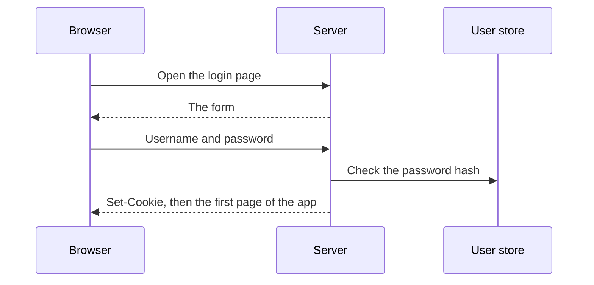
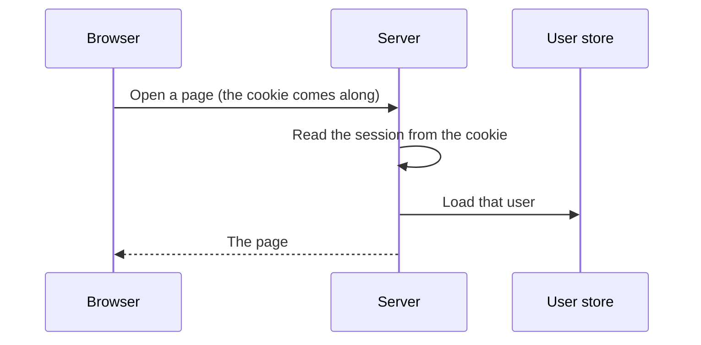
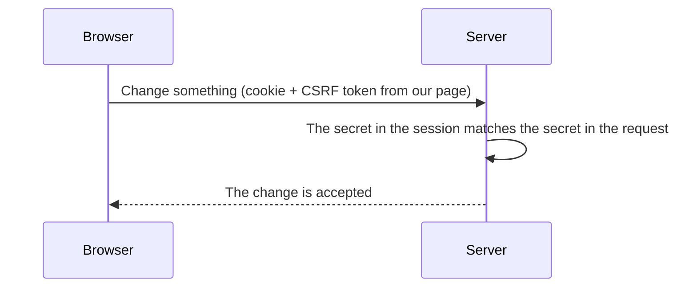
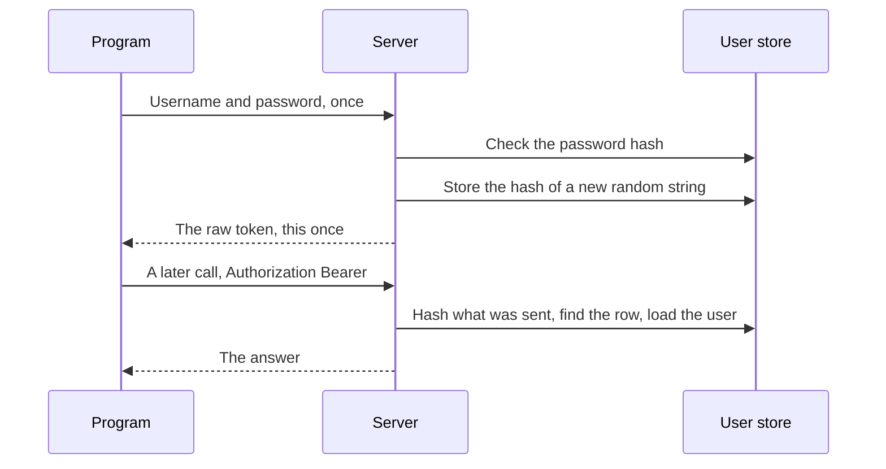

# Signing in, and how the server remembers

A person types a password once. Every request after that is a new one, and HTTP has forgotten the last. This note is how a server keeps treating those requests as the same person.

There are two proofs. A browser carries a **session cookie**. A program carries an **API token**. Both start from the same password check. They travel differently, so they fail differently.

A later note will cover signing in by redirecting to Keycloak.

## HTTP forgets the login

The person typed a username and a password. The server checked the password hash and it matched. Then the person clicks through to a page.

That click is a new request. The server sees "please show me this page" and there is no password in it. So the server has to remember, on its own, that this browser already logged in.

That memory is called a **session**. A session is the stretch of requests, after a successful login, that the server treats as this user.

## A session cookie

Something has to travel with each request and say "this is still that login." What is needed is a unique value that the server created and that the browser sends back. That value is a **token**. When the browser carries it in a cookie, the token is a **session cookie**.

A cookie is a small piece of data the server asks the browser to store. The response says `Set-Cookie`. From then on, the browser attaches that cookie to requests to this site. The person does not copy it. The browser does it.

The server has to be able to turn that value back into a user. Two usual ways:

- The cookie holds only a random session id. The server stores "this id means this user" in a database or in memory, and looks it up.
- The cookie holds the user id itself, and the server **signs** the cookie with a secret only the server knows. A signature check replaces the lookup. There is no session row.

A cookie that simply said `user_id=7`, with no signature and no lookup, would be easy to edit. Change 7 to 1 and the next request would be someone else.

The cookie is also `HttpOnly`. A script on the page cannot read it. Stealing it from the page's own JavaScript is a separate problem from CSRF, below.

## The request after login

The password is not checked again. The cookie says which session this is, and the user still exists. A missing or broken cookie on a page sends the person back to the login form. Sign-out clears the cookie, which ends the session.

If the session lives in a row on the server, deleting that row ends it too. A signed cookie has no such row. It stays valid until it is cleared or it expires.

## CSRF: the cookie sends itself

The useful part of the cookie is that the browser sends it by itself. That is also the hole.

Imagine the person is logged in, so the browser is holding the session cookie. They then open some other site. That site contains a form pointed at our server, for example "delete this record," and the form submits itself. The browser builds a real POST to our server. Because the cookie belongs to our site, the browser attaches it.

The server sees a valid session and would perform the delete. The person never clicked anything on our site. The other site forged the request, and the cookie made it look genuine.

That is **CSRF**, cross-site request forgery. Another site causes the browser to call ours, and the session cookie rides along.

## A second secret

The cookie cannot be the only proof on a write. We need a second secret that the other site does not know, and that the browser will not attach on its own.

At login the server makes a random CSRF token and stores it in the session. When the server renders a page, it also puts that same token into the HTML: a hidden field in a form, or a meta tag. A write that comes from our page sends the token back, in the form or in a header such as `X-CSRF-Token`. The server compares the two copies.

The other site can still make the browser send the cookie. It cannot read our HTML. Pages from one site cannot read pages from another. So it cannot copy the token into the forged form. The cookie arrives, the token does not match, and the write is rejected.

This check belongs on requests that change something: `POST`, `PUT`, `PATCH`, and `DELETE`, when the caller is the session cookie. Reading a page is usually a GET, and a GET is not the place for this secret. Logout changes something (it ends the session), so logout needs the secret too.

## A caller that is not a browser

A script, a mobile app, or an API docs page can call the same server. They are not walking through HTML, and they do not have the browser's habit of storing a cookie and sending it back.

They have the same original problem. The password was checked once, and the next request must still prove who is calling.

## The API token

The thing we hand that program is another unique value, an **API token**.

The program sends the username and password once, to a token endpoint. The server checks the password, creates a long random string, and returns that string. The program stores it and sends it later as `Authorization: Bearer …`. The program attaches that header only when it is written to. A browser does not attach `Authorization` the way it attaches a cookie. A forged page on another site cannot perform the CSRF trick with this header, so the call does not also need the CSRF token.

The database stores a hash of the token, not the token itself. A later request is checked by hashing whatever the caller sent and looking for that hash. If the database leaks, the hashes are not usable tokens.

Deleting that row ends the token. The next call with the same string fails, because the proof is the row.

A docs page such as Swagger is this same exchange. You obtain a token, paste it into Authorize, and the page sends the header on each call.

Knowing who the caller is does not say what they may do. That second question is authorization: a role, or some other rule, checked on the server. Hiding a button is not the check.

## The two proofs

| | Session cookie | API token |
|--|----------------|-----------|
| Who holds it | The browser | The program that asked for it |
| How it comes back | The browser attaches it | `Authorization: Bearer …` |
| What "valid" means | The session id or the signature still maps to a user | The hash matches a stored token |
| Extra check on a write | The CSRF token from our own page | Whatever the role or rule requires |

| Request | Accepted when | Otherwise |
|---------|---------------|-----------|
| A page | The session cookie is valid | Redirect to the login page |
| A write from the browser | That, plus the CSRF token | Rejected |
| `Authorization: Bearer` | The token hash matches a row | Rejected |
| The user is known, and not allowed | The identity check passed, the permission check did not | Rejected |
