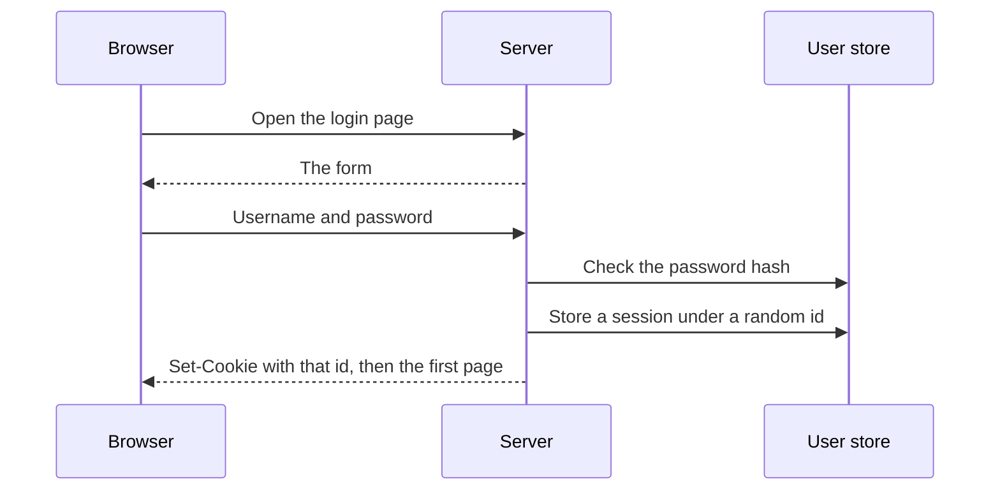
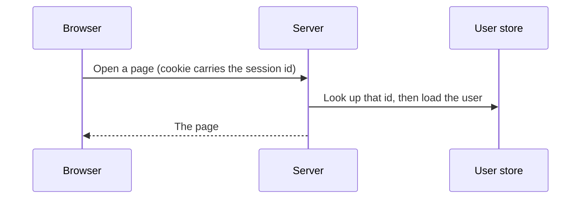
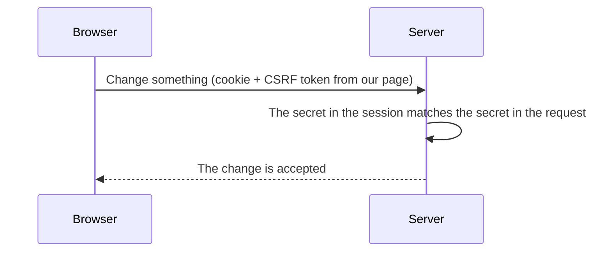
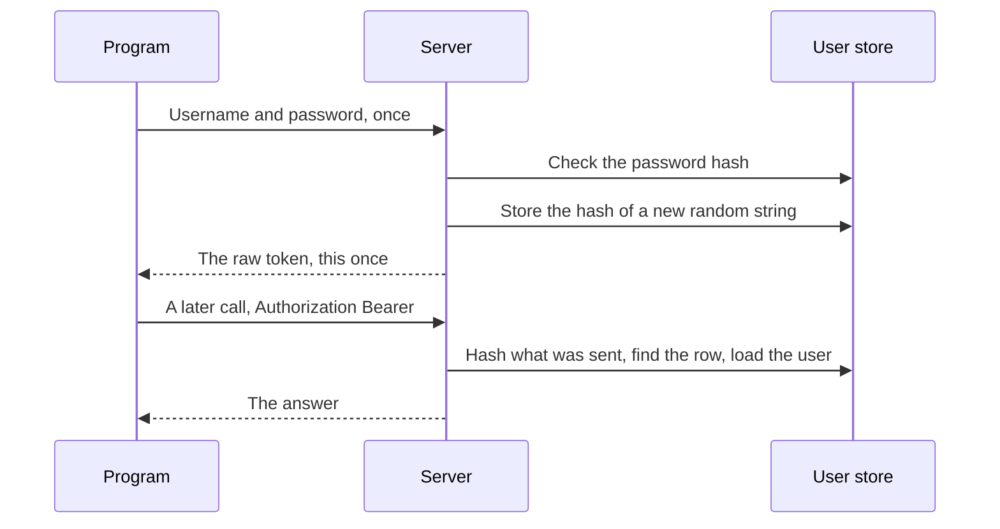
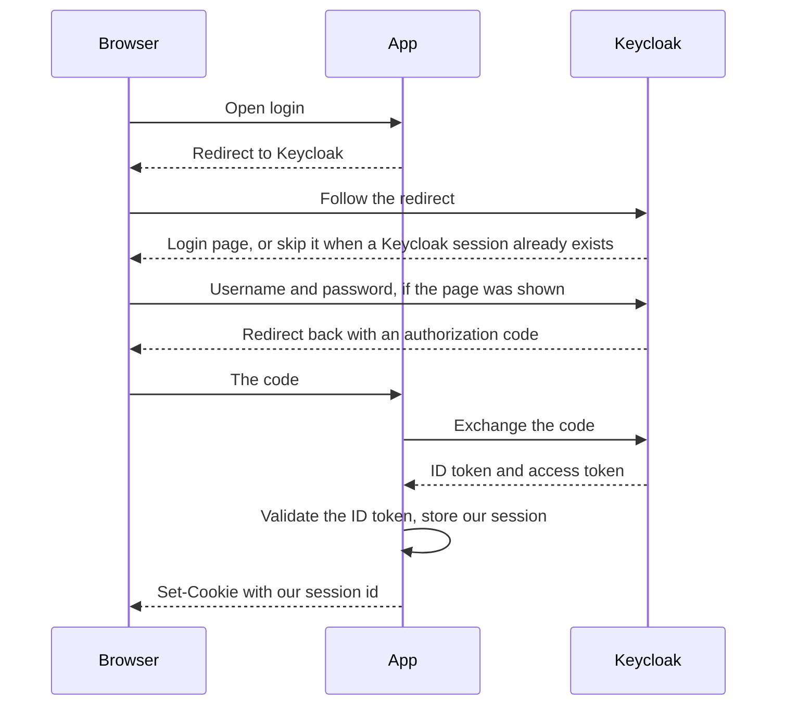
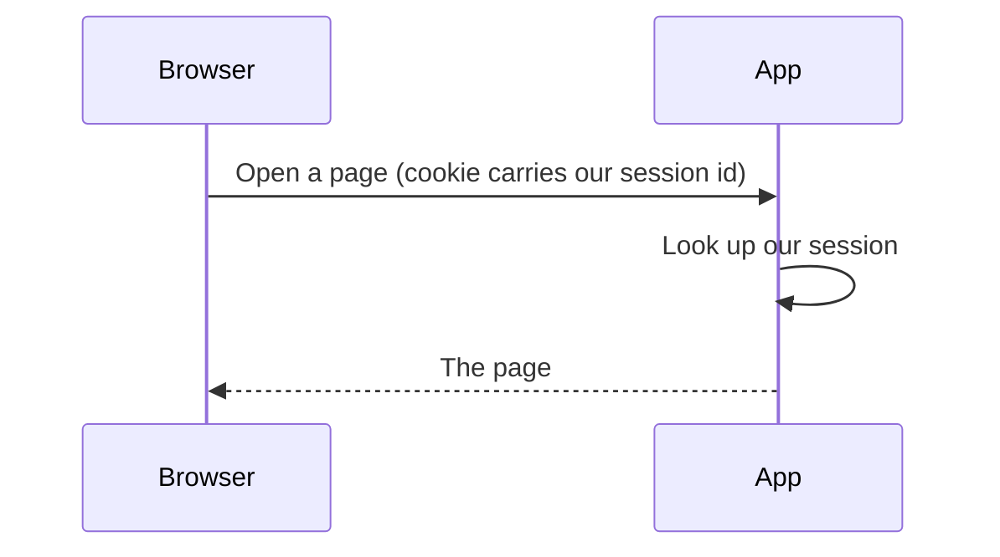
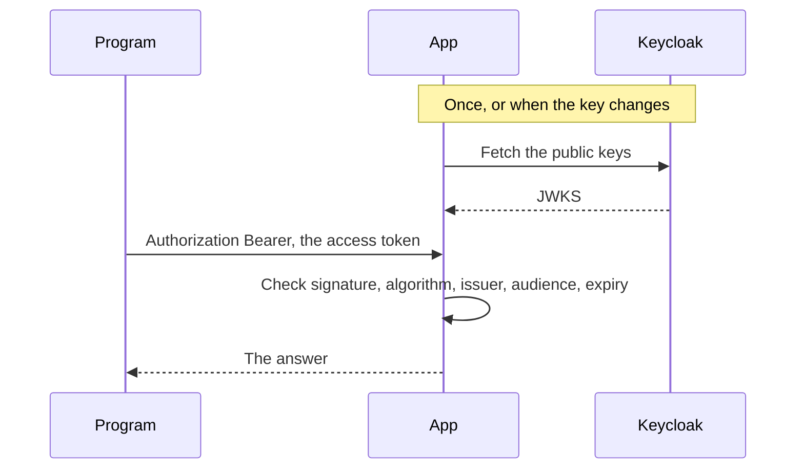

# Signing in, and how the server remembers

A person types a password once. The next click is a new HTTP request. HTTP does not connect that request to the login that came before it. This note is how a server keeps treating those requests as the same person.

In this example the browser story uses a session cookie. An API caller, later, uses a bearer token.

The note is in two parts. Part 1 is the case where our own server checks the password. Part 2 hands that check to Keycloak. Our app still creates its own session. The session cookie and the CSRF check stay.

## Structure

**[Part 1: The server checks the password](#part-1-the-server-checks-the-password)**

- [HTTP forgets the login](#http-forgets-the-login)
- [A session cookie](#a-session-cookie)
- [The request after login](#the-request-after-login)
- [CSRF: the cookie sends itself](#csrf-the-cookie-sends-itself)
- [A second secret](#a-second-secret)
- [A caller that is not a browser](#a-caller-that-is-not-a-browser)
- [The API token](#the-api-token)
- [The two proofs](#the-two-proofs)

**[Part 2: Letting Keycloak check the password](#part-2-letting-keycloak-check-the-password)**

- [The browser is sent away](#the-browser-is-sent-away)
- [The page after Keycloak](#the-page-after-keycloak)
- [The access token on an API call](#the-access-token-on-an-api-call)
- [A form on our site that forwards the password](#a-form-on-our-site-that-forwards-the-password)

**[Appendix: when the wiring gets in the way](#appendix-when-the-wiring-gets-in-the-way)**

## Part 1: The server checks the password

Our server stores the password hash and checks it. It then stores a session.

### HTTP forgets the login

The person typed a username and a password. The server checked the password hash and it matched. Then the person clicks through to a page.

That click is a new request. There is no password in it, and HTTP does not attach "this is the person who just logged in." The server has to remember that itself.

The record it keeps is called a **session**. A session is the server's memory of one login: which user it was, and whatever else this visit needs. The session sits on the server. It is not the cookie. The cookie, next, is only a way to point at it.

### A session cookie

The session needs a name, or the next request cannot find it. The server creates a random **session ID**. The ID is not the user, and it is not the session. It only names the session record.

The browser has to send that ID back. In this example the carrier is a **cookie**. A cookie is a small value the server asks the browser to store. The response says `Set-Cookie`. On later requests to this site, the browser can attach it. The person does not copy it.

Three different things are easy to fold together:

- The **session** is the record on the server.
- The **session ID** is the random value that names that record.
- The **cookie** is the mechanism that carries the ID.

The server reads the ID from the cookie and looks up the session. A cookie that simply said `user_id=7`, with no lookup, would be easy to edit. Change 7 to 1 and the next request would be someone else.

Three settings on the cookie are worth knowing:

- `HttpOnly` means a script on the page cannot read the cookie.
- `Secure` means the browser sends it only on HTTPS.
- `SameSite` tells the browser when it may attach the cookie to a request that began on another site. That choice shows up in the CSRF story below.

Some applications skip the server-side record. They put the user id in the cookie and **sign** the cookie with a secret only the server knows. A signature shows that the server wrote the value. It does not hide the value. Hiding it would be encryption. Anyone who can see the cookie can read the user id, and they cannot change it without breaking the signature. This note stays with the server-side session. The signed cookie is only the other common shape.

### The request after login

The password is not checked again. The ID names a session, and the session names the user. A missing or unknown ID on a page sends the person back to the login form.

Sign-out does two things. It deletes the session on the server, and it clears the cookie in the browser. Deleting the session matters: a stolen copy of the cookie then points at nothing. Clearing only the browser's copy would leave the server session in place.

A signed cookie, the alternative above, has no server record to delete. Clearing it removes the browser's copy. A copy someone already stole stays valid until it expires, because the signature still checks out.

### CSRF: the cookie sends itself

The useful part of the cookie is that the browser sends it by itself. That is also the hole.

Imagine the person is logged in, so the browser is holding the session cookie. They then open some other site. That site contains a form pointed at our server, for example "delete this record," and the form submits itself. The browser builds a real POST to our server. Whether our cookie rides along depends on `SameSite`, and on whether the request counts as cross-site. When the cookie does ride along, the server sees a valid session and would perform the delete. The person never clicked anything on our site.

That is **CSRF**, cross-site request forgery. Another site causes the browser to call ours, and the session cookie may ride along. `SameSite` blocks some of those attachments. It is not the check this example relies on. The next section still adds a secret of our own.

### A second secret

The cookie cannot be the only proof on a write. We need a second secret that the other site does not know, and that the browser will not attach on its own.

At login the server makes a random CSRF token and stores it in the session. When the server renders a page, it also puts that same token into the HTML: a hidden field in a form, or a meta tag. A write that comes from our page sends the token back, in the form or in a header such as `X-CSRF-Token`. The server compares the two copies.

When the browser does attach the cookie, the other site still cannot read our HTML. Pages from one site cannot read pages from another. So it cannot copy the CSRF token into the forged form. The cookie may arrive, the token does not match, and the write is rejected.

This check belongs on requests that change something: `POST`, `PUT`, `PATCH`, and `DELETE`, when the caller is the session cookie. Reading a page is usually a GET, and a GET is not the place for this secret. Logout changes something (it ends the session), so logout needs the secret too.

### A caller that is not a browser

A script, a mobile app, or an API docs page can call the same server. In this example they are not walking through our HTML, so they do not pick up the session cookie from a page.

They have the same original problem. The password was checked once, and the next request must still say who is calling.

### The API token

The thing we hand that caller is another unique value, an **API token**. The token is the value. `Authorization: Bearer …` is only the header that carries it, the way a cookie carried the session ID.

The caller sends the username and password once, to a token endpoint. The server checks the password, creates a long random string, and returns that string. The caller stores it and puts it in the header on later requests. Nothing attaches that header automatically. A forged page does not get this CSRF trick for free, because the browser will not add the victim's bearer token on its own. Knowing who is calling is authentication. Deciding what they may do is authorization. That second check applies to a cookie request and a bearer request alike.

The database stores a hash of the token, not the token itself. A later request is checked by hashing whatever the caller sent and looking for that hash. If the database leaks, the hashes are not usable tokens.

Deleting that row ends the token. The next call with the same string fails, because the proof is the row.

A docs page such as Swagger does this only when it is configured to. One common setup is a box where you paste a bearer token. The page then sends that header. Hiding a button is not the permission check.

### The two proofs

| | Session cookie | API token |
|--|----------------|-----------|
| The value | A random session ID | A random token string |
| Who stores the value | The browser, inside a cookie | The caller that asked for it |
| How it travels | The browser attaches the cookie | `Authorization: Bearer …` |
| What "valid" means | The ID names a session we still store | The hash matches a stored token |
| On a write | The CSRF token from our page, then the permission check | The permission check |

## Part 2: Letting Keycloak check the password

The first half assumes our server is the one that checks the password. That works for one application. It gets awkward when several applications should share a login, or when the password should be checked by a service that also does one-time codes, passkeys, and account lockout.

**Keycloak** is that service. It is a separate site whose job is to log people in. Our application becomes a client of it. The password is typed on Keycloak's page. Our app still creates the session from Part 1, and the browser still carries our session ID in our cookie.

This way of logging in is **OpenID Connect**. The browser is sent to Keycloak and comes back with a one-time code. Our server exchanges that code, checks the login result, and only then creates the session. A maintained OpenID Connect library should do the exchange and the checks. The sequence below is the model, not a recipe to implement by hand.

### The browser is sent away

Our login link does not show a password form. It sends the browser to Keycloak. The redirect names our application, a client id.

Keycloak shows its own login page. If this browser already logged in to Keycloak, it skips the form. That is Keycloak's own session cookie, on Keycloak's site, separate from ours.

Keycloak then sends the browser back to our callback address with a one-time **authorization code**. The code is not the password, and it is not yet proof of who the user is. Our server sends the code to Keycloak. Keycloak returns an **ID token**. That token is the login result: who the person is. Keycloak also returns an **access token**. That one is a credential for calling an API, and the next section uses it. The exchange is the moment our server talks to Keycloak during login.

Our server validates the ID token, reads the user, stores a session under a new random ID, and sets our cookie. From here, Part 1 applies again.

Two extra values travel with a real login, and they are easy to leave out of the picture above. `state` is a random value we store before the redirect and check on the way back, so this callback belongs to the visit that started it. **PKCE** is a one-time proof that the party exchanging the code is the party that started the redirect. PKCE does not replace a client secret. A server-side client that can keep a secret still authenticates with that secret when it exchanges the code. A public client cannot keep a secret, so it cannot authenticate as a confidential client does. PKCE still binds the code exchange to the party that started the login. The library mentioned above is what should attach both.

### The page after Keycloak

Keycloak is not called. The page uses our session, which has its own lifetime. The access token expiring does not end that session. CSRF still applies to a write, because the browser may still attach our cookie. The permission check still applies too.

Sign-out deletes our session and clears our cookie. It should also send the browser to Keycloak's logout, so Keycloak's session ends too. Clearing only our cookie leaves Keycloak's session in place, and the next login can skip the form again.

### The access token on an API call

An API caller still does not use our session cookie in this example. In Part 1 we minted a random string and stored its hash. With Keycloak, the caller presents the **access token** Keycloak issued. That token is the credential for the API. The ID token from the login is not reused for this.

The access token is a **JWT**: three parts, header, claims, and a signature. Our server checks it locally:

- the signature, using Keycloak's **public key**
- the algorithm, which must be one we allow
- the issuer, which must be our Keycloak
- the audience, which must be this API
- the expiry

The private key never leaves Keycloak. The public keys are published at a certificate address (JWKS). Our server fetches them and caches them, so a normal API call does not wait on Keycloak.

The check is local. It does not hear that Keycloak has since signed the user out, or disabled them, until the token expires. Asking Keycloak "is this token still valid?" on every request is possible. It is a round trip each time. This example trusts the checks above instead.

A docs page such as Swagger sends that token only when it is configured to. One configuration runs the same browser login, then stores the access token and sends it as `Authorization`. If the browser already has Keycloak's session cookie, that login form can be skipped. Another configuration is still the paste-a-token box from Part 1. The page does not pick one on its own.

### A form on our site that forwards the password

It is tempting to keep our own login form and have our server pass the username and password to Keycloak. That is the old password grant, also called a direct access grant. Current OAuth security guidance says this grant must not be used. Our server would receive the password, and the browser would never visit Keycloak, so Keycloak would not set its own session.

### Appendix: when the wiring gets in the way

The browser and our server often use different addresses for the same Keycloak. The person opens `localhost` on a published port. Our server calls Keycloak by its internal name. The token says which address issued it, and that address has to be one we accept.

A fixed public hostname can make Keycloak mark its login cookie `Secure` while the site is still plain HTTP. The browser then drops the cookie, and Keycloak reports that the login cookie is missing.

Keycloak may also stop the person on an extra step, such as "finish your profile," when the account has no email. Our callback never runs until that step is done.

Checking the signature needs a library that can do the cryptography. A JWT parser alone will reject a Keycloak token signed with RS256.
