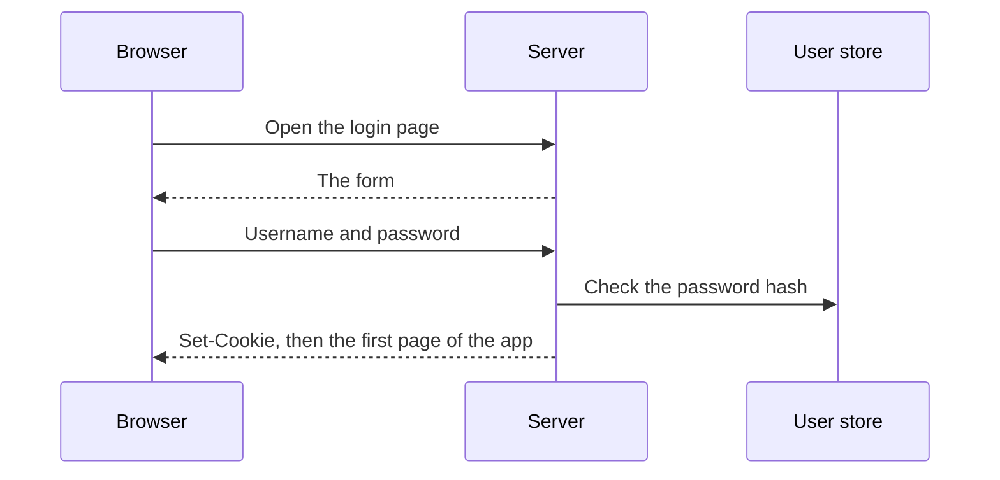
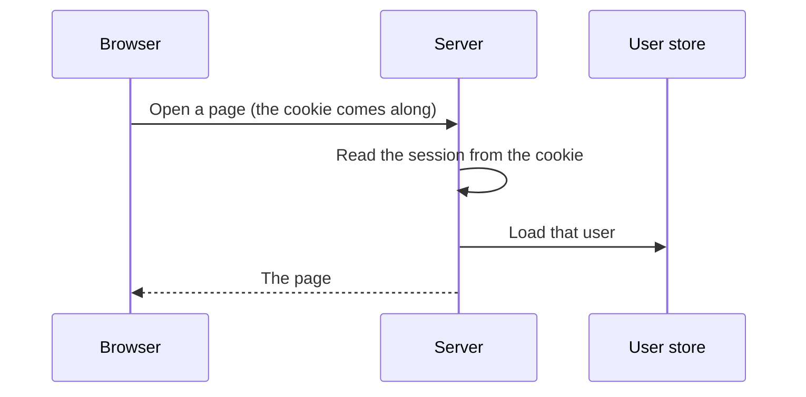
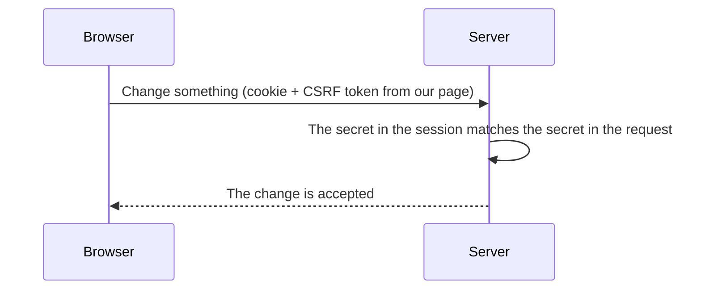
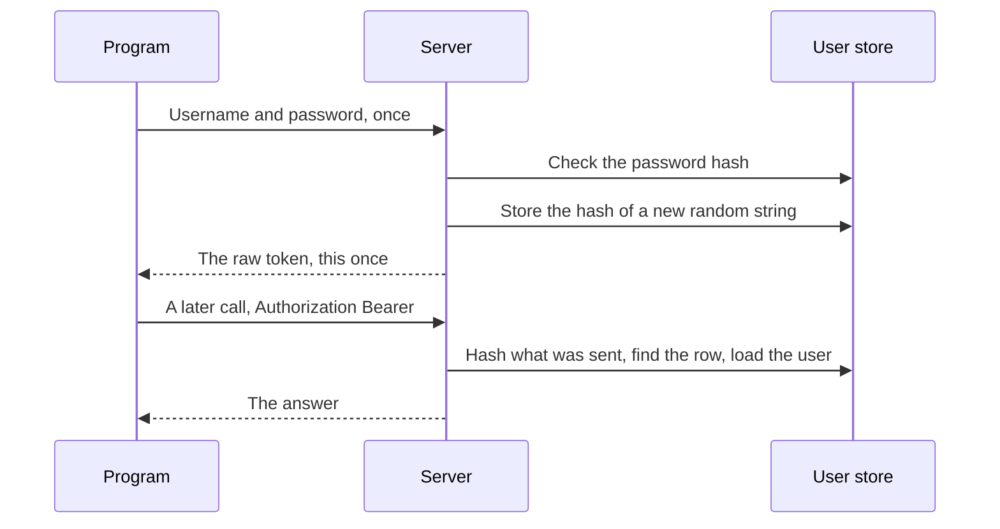
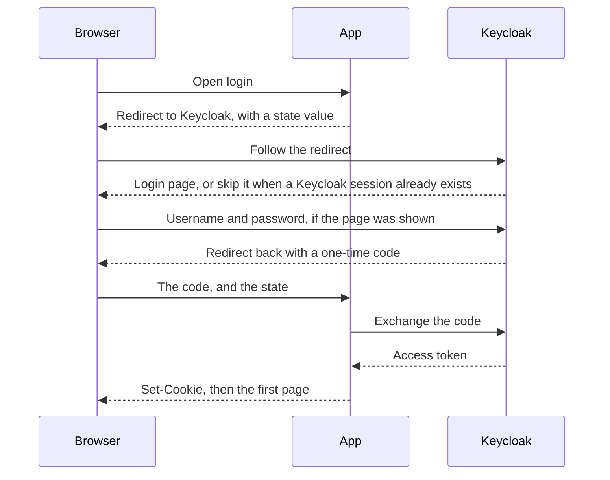
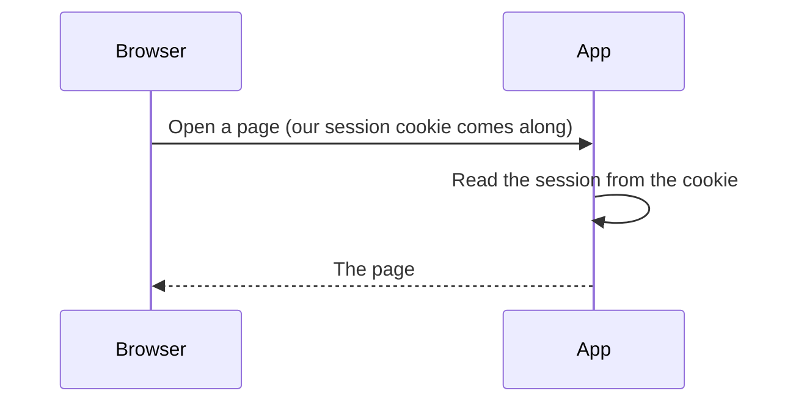
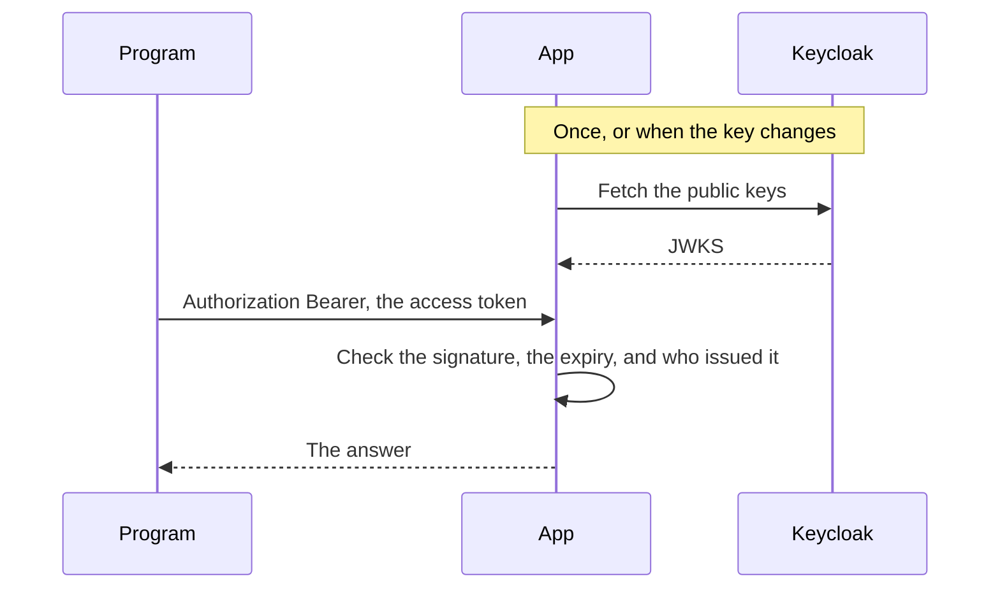

# Signing in, and how the server remembers

A person types a password once. Every request after that is a new one, and HTTP has forgotten the last. This note is how a server keeps treating those requests as the same person.

There are two proofs. A browser carries a **session cookie**. A program carries an **API token**. Both start from a password check. They travel differently, so they fail differently.

The note is in two parts. Part 1 is the case where our own server checks the password. Part 2 hands that check to Keycloak. The session cookie and the CSRF check stay. The API token changes.

## Structure

**[Part 1: The server checks the password](#part-1-the-server-checks-the-password)**

- [HTTP forgets the login](#http-forgets-the-login)
- [A session cookie](#a-session-cookie)
- [The request after login](#the-request-after-login)
- [CSRF: the cookie sends itself](#csrf-the-cookie-sends-itself)
- [A second secret](#a-second-secret)
- [A caller that is not a browser](#a-caller-that-is-not-a-browser)
- [The API token](#the-api-token)
- [The two proofs](#the-two-proofs)

**[Part 2: Letting Keycloak check the password](#part-2-letting-keycloak-check-the-password)**

- [The browser is sent away](#the-browser-is-sent-away)
- [The page after Keycloak](#the-page-after-keycloak)
- [The access token on an API call](#the-access-token-on-an-api-call)
- [A form on our site that forwards the password](#a-form-on-our-site-that-forwards-the-password)
- [What usually gets in the way](#what-usually-gets-in-the-way)

## Part 1: The server checks the password

Our server stores the password hash and checks it. The browser then carries a session cookie. A program carries an API token we created.

### HTTP forgets the login

The person typed a username and a password. The server checked the password hash and it matched. Then the person clicks through to a page.

That click is a new request. The server sees "please show me this page" and there is no password in it. So the server has to remember, on its own, that this browser already logged in.

That memory is called a **session**. A session is the stretch of requests, after a successful login, that the server treats as this user.

### A session cookie

Something has to travel with each request and say "this is still that login." What is needed is a unique value that the server created and that the browser sends back. That value is a **token**. When the browser carries it in a cookie, the token is a **session cookie**.

A cookie is a small piece of data the server asks the browser to store. The response says `Set-Cookie`. From then on, the browser attaches that cookie to requests to this site. The person does not copy it. The browser does it.

The server has to be able to turn that value back into a user. Two usual ways:

- The cookie holds only a random session id. The server stores "this id means this user" in a database or in memory, and looks it up.
- The cookie holds the user id itself, and the server **signs** the cookie with a secret only the server knows. A signature check replaces the lookup. There is no session row.

A cookie that simply said `user_id=7`, with no signature and no lookup, would be easy to edit. Change 7 to 1 and the next request would be someone else.

The cookie is also `HttpOnly`. A script on the page cannot read it. Stealing it from the page's own JavaScript is a separate problem from CSRF, below.

### The request after login

The password is not checked again. The cookie says which session this is, and the user still exists. A missing or broken cookie on a page sends the person back to the login form. Sign-out clears the cookie, which ends the session.

If the session lives in a row on the server, deleting that row ends it too. A signed cookie has no such row. It stays valid until it is cleared or it expires.

### CSRF: the cookie sends itself

The useful part of the cookie is that the browser sends it by itself. That is also the hole.

Imagine the person is logged in, so the browser is holding the session cookie. They then open some other site. That site contains a form pointed at our server, for example "delete this record," and the form submits itself. The browser builds a real POST to our server. Because the cookie belongs to our site, the browser attaches it.

The server sees a valid session and would perform the delete. The person never clicked anything on our site. The other site forged the request, and the cookie made it look genuine.

That is **CSRF**, cross-site request forgery. Another site causes the browser to call ours, and the session cookie rides along.

### A second secret

The cookie cannot be the only proof on a write. We need a second secret that the other site does not know, and that the browser will not attach on its own.

At login the server makes a random CSRF token and stores it in the session. When the server renders a page, it also puts that same token into the HTML: a hidden field in a form, or a meta tag. A write that comes from our page sends the token back, in the form or in a header such as `X-CSRF-Token`. The server compares the two copies.

The other site can still make the browser send the cookie. It cannot read our HTML. Pages from one site cannot read pages from another. So it cannot copy the token into the forged form. The cookie arrives, the token does not match, and the write is rejected.

This check belongs on requests that change something: `POST`, `PUT`, `PATCH`, and `DELETE`, when the caller is the session cookie. Reading a page is usually a GET, and a GET is not the place for this secret. Logout changes something (it ends the session), so logout needs the secret too.

### A caller that is not a browser

A script, a mobile app, or an API docs page can call the same server. They are not walking through HTML, and they do not have the browser's habit of storing a cookie and sending it back.

They have the same original problem. The password was checked once, and the next request must still prove who is calling.

### The API token

The thing we hand that program is another unique value, an **API token**.

The program sends the username and password once, to a token endpoint. The server checks the password, creates a long random string, and returns that string. The program stores it and sends it later as `Authorization: Bearer …`. The program attaches that header only when it is written to. A browser does not attach `Authorization` the way it attaches a cookie. A forged page on another site cannot perform the CSRF trick with this header, so the call does not also need the CSRF token.

The database stores a hash of the token, not the token itself. A later request is checked by hashing whatever the caller sent and looking for that hash. If the database leaks, the hashes are not usable tokens.

Deleting that row ends the token. The next call with the same string fails, because the proof is the row.

A docs page such as Swagger is this same exchange. You obtain a token, paste it into Authorize, and the page sends the header on each call.

Knowing who the caller is does not say what they may do. That second question is authorization: a role, or some other rule, checked on the server. Hiding a button is not the check.

### The two proofs

| | Session cookie | API token |
|--|----------------|-----------|
| Who holds it | The browser | The program that asked for it |
| How it comes back | The browser attaches it | `Authorization: Bearer …` |
| What "valid" means | The session id or the signature still maps to a user | The hash matches a stored token |
| Extra check on a write | The CSRF token from our own page | Whatever the role or rule requires |

| Request | Accepted when | Otherwise |
|---------|---------------|-----------|
| A page | The session cookie is valid | Redirect to the login page |
| A write from the browser | That, plus the CSRF token | Rejected |
| `Authorization: Bearer` | The token hash matches a row | Rejected |
| The user is known, and not allowed | The identity check passed, the permission check did not | Rejected |

## Part 2: Letting Keycloak check the password

The first half assumes our server is the one that checks the password. That works for one application. It gets awkward when several applications should share a login, or when the password should be checked by a service that also does one-time codes, passkeys, and account lockout.

**Keycloak** is that service. It is a separate site whose job is to log people in. Our application becomes a client of it. The person still ends up with a session cookie on our site. The password is typed on Keycloak's page.

This way of logging in is **OpenID Connect**. The browser is sent to Keycloak and comes back with proof. Our server turns that proof into the same kind of session the first half already described.

### The browser is sent away

Our login link does not show a password form. It sends the browser to Keycloak. The redirect names our application (a client id) and includes a random `state` value we store in the visit, so we can recognise the return trip.

Keycloak shows its own login page. If this browser already logged in to Keycloak, it skips the form. That is Keycloak's own session cookie, on Keycloak's site, separate from ours.

Keycloak then sends the browser back to our callback address with a one-time **code**. The code is not the password, and it is not yet the token. Our server sends the code to Keycloak and receives an **access token** in return. That exchange is the moment our server talks to Keycloak. It happens once, at login.

The access token is a signed bundle of claims: who the person is, which roles they have, and when the token expires. Our server checks the signature, reads the user, and then does what the first half already did. It sets our session cookie.

The `state` must match the one we stored before the redirect. A callback that arrives with a different state is dropped.

### The page after Keycloak

Keycloak is not called. The page is authenticated the same way as in the first half: our cookie. CSRF on a write is unchanged, because the browser is still attaching that cookie by itself.

Sign-out clears our cookie. It should also send the browser to Keycloak's logout, so Keycloak's session ends too. Clearing only our cookie leaves Keycloak's session in place, and the next login can skip the form again.

### The access token on an API call

A program still cannot use the browser cookie. In the first half we minted a random string and stored its hash. With Keycloak, the program presents an access token Keycloak already signed.

The token is a **JWT**: three parts, header, claims, and a signature. Our server checks the signature with Keycloak's **public key**. The matching private key never leaves Keycloak. The public keys are published at a certificate address (JWKS). Our server fetches them and caches them. A normal API call does not wait on Keycloak.

The check is local. Disabling the user in Keycloak, or signing them out there, does not reach our API until the token expires. Asking Keycloak "is this token still valid?" on every request is possible. It is a round trip each time. The usual API setup trusts the signature and the expiry instead.

An API docs page uses the same token. **Authorize** sends the browser through Keycloak and, when it comes back, holds the access token and sends it as `Authorization`. The client id for that page is public, so it has no secret to keep. **PKCE** fills that gap: the page invents a one-time proof when it starts the redirect, and must show the same proof when the code is exchanged. A code stolen from the redirect is useless without that proof.

If the browser already has Keycloak's session cookie, Authorize does not show the login form. The token is still issued, for the person who is already signed in there.

A server-side application can keep a client secret and exchange the code itself. A public client, such as Swagger or a mobile app, uses PKCE and does not get a secret.

### A form on our site that forwards the password

It is tempting to keep our own login form and have our server pass the username and password to Keycloak. Keycloak can accept that. It is called a direct access grant, the old password grant.

The cost shows up immediately. Our server receives the password. Keycloak also does not set its session cookie, because the browser never visited Keycloak. The silent Authorize from the previous section disappears, and a second application will ask for the password again. One-time codes, passkeys, and "update your profile" never appear, unless our form learns to handle each of them.

The redirect exists so the password stays on Keycloak's page. A theme can change how that page looks. The theme is Keycloak's, on Keycloak's address.

### What usually gets in the way

The browser and our server often use different addresses for the same Keycloak. The person opens `localhost` on a published port. Our server calls Keycloak by its internal name. The token says which address issued it, and that address has to be one we accept.

A fixed public hostname can make Keycloak mark its login cookie `Secure` while the site is still plain HTTP. The browser then drops the cookie, and Keycloak reports that the login cookie is missing.

Keycloak may also stop the person on an extra step, such as "finish your profile," when the account has no email. Our callback never runs until that step is done.

Checking the signature needs a library that can do the cryptography. A JWT parser alone will reject a Keycloak token signed with RS256.
