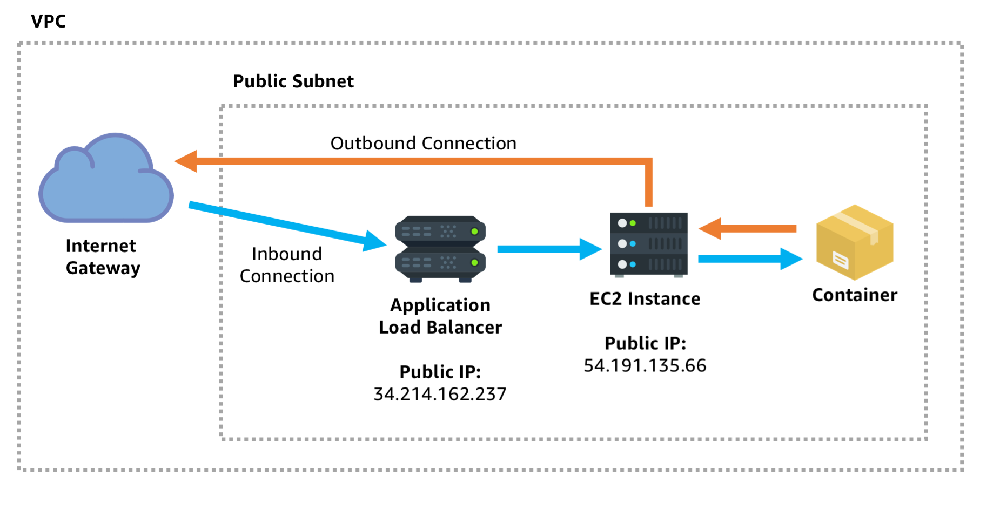
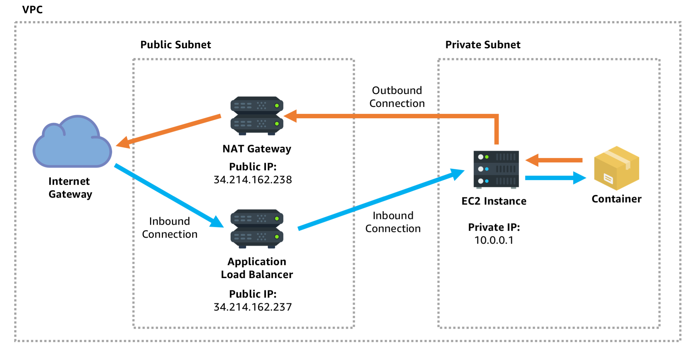

# Public Service, Public Network

A public facing service is one of the most common architecture patterns for deploying containers on AWS. It is well suited for:

-   A static HTML website, perhaps hosted by NGINX or Apache
-   A dynamically generated web app, perhaps served by a Node.js process
-   An API service intended for the public to access
-   A public facing endpoint designed to receive push notifications, perhaps from Amazon SNS (Simple Notification Service)
-   An edge service which needs to make outbound connections to other services on the internet

Everything is deployed in an Amazon Virtual Private Cloud (VPC) which has a subnet exposed to the internet. An internet gateway is attached to allow resources launched in the VPC to accept connections from the internet, and initiate connections to the internet. Inside the VPC each resource has its own public IP address. A few resources are included:

-   A public facing load balancer which accepts inbound connections on specific ports
-   One or more EC2 instances hosting the application container, configured to accept inbound connections from the load balancer on specific ports (optionally from any source).

# Public Service, Private Network

Sometimes you want to create a public facing service, but you want stricter control over the networking of the service. This pattern is suitable for many of the same use cases of the [public facing service](https://containersonaws.com/architecture/public-service-public-network.html), but it is especially used in the following cases:

-   A service which is public facing but needs an extra layer of security hardening by not even having a public IP address that an attacker could send a request directly to.
-   A service which needs to be massively horizontally scalable while not being constrained by number of IP addresses available.
-   A service which initiates outbound connections but to the public you want those connections to originate from a specific and limited set of IP addresses that can be whitelisted.

Everything is deployed in an Amazon Virtual Private Cloud (VPC) which has two subnets:

-   **Public subnet**: Has an attached internet gateway to allow resources launched in that subnet to accept connections from the internet, and initiate connections to the internet. Resources in this subnet have public IP addresses.
-   **Private subnet**: For internal resources. Instances in this subnet have no direct internet access, and only have private IP addresses that are internal to the VPC, not directly accessible by the public.

The public facing subnet hosts a couple resources:

-   **Public facing load balancer**: Accepts inbound connections on specific ports, and forwards acceptable traffic to resources inside the private subnet.
-   **NAT gateway**: A networking bridge to allow resources inside the private subnet to initiate outbound communications to the internet, while not allowing inbound connections.

The private subnet is used to run your application containers. The EC2 instances hosting the containers do not have a public IP address, only a private IP address internal to the VPC. As a result if your application initiates an outbound connection the connection gets routed through the NAT gateway in the public subnet. Additionally, there is no way for any traffic to directly reach your container. Instead all inbound connections must go to the load balancer which will pick and choose whether to pass the inbound connection on to the protected container inside the private VPC subnet.

# Private Service, Private Network

A private service is generally used for important internal business services that need to be protected from direct access by the public:

-   Cache service such as Redis
-   Internal API that provides a thin wrapper around a database
-   Billing, password and authentication, or other similar service that has personally identifying information.

Just as in the previous architecture this design has Amazon Virtual Private Cloud (VPC) with two subnets:

-   **Public subnet**: Has an attached internet gateway to allow resources launched in that subnet to accept connections from the internet, and initiate connections to the internet. Resources in this subnet have public IP addresses. In this design there is a public facing service, perhaps an API gateway. End users are able to initiate a blue connection through the internet gateway and public facing load balancer, to the API gateway container.
-   **Private subnet**: For internal resources. Instances in this subnet have no direct internet access, and only have private IP addresses that are internal to the VPC, not directly accessible by the public. This is where the private service is running. The private tier of the application stack has its own private load balancer which is not accessible to the public. The API gateway service is able to initiate a green connection to the private load balancer in order to reach the private service, but the public can not.

# Private Service, Service Discovery

