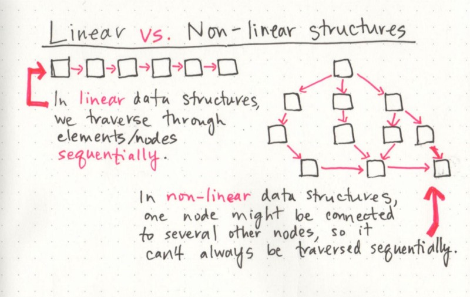
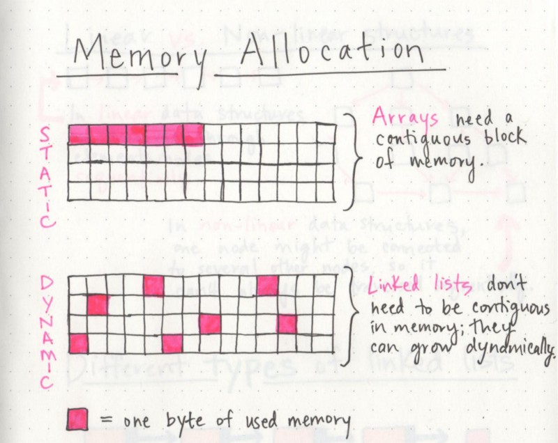

# basecs

by  Vaidehi Joshi [@vaidehijoshi](https://twitter.com/vaidehijoshi)

## What’s a Linked List, Anyway? [Part 1]

One characteristic of linked lists is that they are **linear data structures**, which means that there is a sequence and an order to how they are constructed and traversed.

