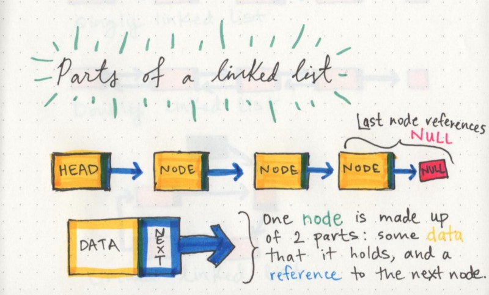

# basecs

by  Vaidehi Joshi [@vaidehijoshi](https://twitter.com/vaidehijoshi)

## What’s a Linked List, Anyway? [Part 1]

One characteristic of linked lists is that they are **linear data structures**, which means that there is a sequence and an order to how they are constructed and traversed. Linear structures, however, are the opposite of non-linear structures. In **non-linear data structures**, items don't have to be arranged in order, which means that we could traverse the data structure *non-sequentially*.

The biggest differentiator between arrays and linked lists is the way that they use memory in our machines.

The fundamental difference between arrays and linked lists is that arraysare **static data structures**, whilelinked listsare **dynamic data structures**. A static data structure needs all of its resources to be allocated when the structure is created; this means that even if the structure was to grow or shrink in size and elements were to be added or removed, it still *always needs a given size and amount of memory.* If more elements needed to be added to a static data structure and it didn't have enough memory, you'd need to copy the data of that array, for example, and recreate it with more memory, so that you could add elements to it.

On the other hand, a dynamic data structure can shrink and grow in memory. It doesn't need a set amount of memory to be allocated in order to exist, and its size and shape can change, and the amount of memory it needs can change as well.

> A node only knows about what data it contains, and who its neighbor is.

A ***circular linked list*** is a little odd in that it doesn't end with a node pointing to a null value. Instead, it has a node that acts as the *tail* of the list (rather than the conventional head node), and the node after the tail node is the beginning of the list. This organization structure makes it really easy to add something to the end of the list, because you can begin traversing it at the **tail**node, as the first element and last element point to one another. Circular linked lists can start to get really crazy because we can turn both a singly linked list and a doubly linked list *into* a circular linked list!

