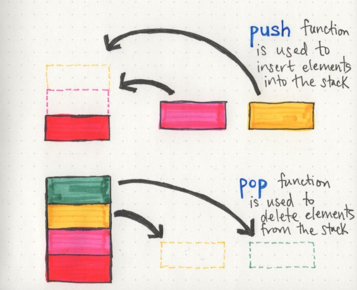

# basecs

by  Vaidehi Joshi [@vaidehijoshi](https://twitter.com/vaidehijoshi)

Click to jump directly to section:
 - [What’s a Linked List, Anyway? [Part 1]](#whats-a-linked-list-anyway-part-1)
 - [What’s a Linked List, Anyway? [Part 2]](#whats-a-linked-list-anyway-part-2)
 - [Stacks and Overflows](#stacks_and_overflows)
 - [To Queue Or Not To Queue](#to-queue-or-not-to-queue)
 - [How To Not Be Stumped By Trees](#how-not-to-be-stumped-by-trees)
 - [Leaf It Up To Binary Trees](#leaf-it-up-to-binary-trees)

 
 
 
 
 

## What’s a Linked List, Anyway? [Part 1]

One characteristic of linked lists is that they are **linear data structures**, which means that there is a sequence and an order to how they are constructed and traversed. Linear structures, however, are the opposite of non-linear structures. In **non-linear data structures**, items don't have to be arranged in order, which means that we could traverse the data structure *non-sequentially*.

The biggest differentiator between arrays and linked lists is the way that they use memory in our machines.

The fundamental difference between arrays and linked lists is that arraysare **static data structures**, whilelinked listsare **dynamic data structures**. A static data structure needs all of its resources to be allocated when the structure is created; this means that even if the structure was to grow or shrink in size and elements were to be added or removed, it still *always needs a given size and amount of memory.* If more elements needed to be added to a static data structure and it didn't have enough memory, you'd need to copy the data of that array, for example, and recreate it with more memory, so that you could add elements to it.

On the other hand, a dynamic data structure can shrink and grow in memory. It doesn't need a set amount of memory to be allocated in order to exist, and its size and shape can change, and the amount of memory it needs can change as well.

> A node only knows about what data it contains, and who its neighbor is.

A ***circular linked list*** is a little odd in that it doesn't end with a node pointing to a null value. Instead, it has a node that acts as the *tail* of the list (rather than the conventional head node), and the node after the tail node is the beginning of the list. This organization structure makes it really easy to add something to the end of the list, because you can begin traversing it at the **tail**node, as the first element and last element point to one another. Circular linked lists can start to get really crazy because we can turn both a singly linked list and a doubly linked list *into* a circular linked list!

 
 
 
 
 

## What’s a Linked List, Anyway? [Part 2]

> There are two major points to consider when thinking about how an algorithm performs: how much time it requires at runtime given how much time and memory it needs.

As far as linked lists go, however, the two types of Big O equations to remember are O(1) and O(n).

Inserting an element at the beginning of a linked list is particularly nice and efficient because **it takes the same amount of time, no matter how long our list is**, which is to say it has a space time complexity that is *constant*, or **O(1)**.

A good rule of thumb for remember the characteristics of linked lists is this:

> a linked list is usually efficient when it comes to adding and removing most elements, but can be very slow to search and find a single element.

 
 
 
 
 

## Stacks and Overflows

	

Regardless of which language a stack is implemented in, there are a couple functions that will almost always be needed:

-   **push**: the function that's used to add elements into the stack
-   **pop**: the function that's used to remove elements from the stack
-   **top** (***peek***): a function that returns the first value (what's on top of the stack), but doesn't remove it
-   **isEmpty**: a function that checks if the stack is empty or not --- super helpful when trying to clear all the elements from a stack
-   **size**: a function that returns the number of elements that are in a stack at any given time

 
 
 
 
 

## To Queue Or Not To Queue

When multiple (think hundreds or hundreds of thousands) of machines request data or send data to an application's server, the server can be inundated with a lot of requests. Have you ever wondered how it handles those request? And how it processes all of them...without exploding?

Well, there's method to madness, and as it turns out, the method is a queue. **Request queuing** is the procedure of handling requests before they even enter an application to be processed.

 
 
 
 
 

## How To Not Be Stumped By Trees

In **linear data structures --- **such as arrays or linked lists --- the data is ordered, and that order matters; the way that you traverse a linear data structure is directly related to its order, because the elements in a linear data structure can only be traversed *sequentially*.

...a root node could have links to *multiple* other nodes. And *this right here* is the fundamental difference between the linear structures we've looked at so far and the trees we're learning about now. One node can connect to many others, which means that trees can grow in different shapes and ways.

Just as long as you can remember that***the data is hierarchical* **in nature, the jargon should hopefully be little less worrisome to think about.

Trees are **recursive data structures** because a tree is usually composed of smaller trees --- often referred to as *subtrees* --- inside of it. The child of one node in a tree could very well be the parent of another tree (making it the root node of a subtree). This can be really interesting when it comes to writing algorithms to traverse or search through a tree, since the nesting of trees can sometimes lead us to writing recursive search algorithms.

The reason that depth and height are so important is because they tell us a lot about what a tree looks like, right off the bat. And the thing about trees is that they can all look different. One quick example of this is **balanced trees versus unbalanced trees**.

A tree is considered to be **balanced** if any two sibling subtrees do not differ in height by more than one level. However, if two sibling subtrees differ significantly in height (and have more than one level of depth of difference), the tree is **unbalanced**.

Balanced trees come up when we talk about tree operations, and traversal in particular. The idea behind this is that if we can traverse a tree and cut down on half of the number of operations, we'll have a better performing data structure. However, in an unbalanced tree, this definitely is not the case, because one subtree could be significantly larger than its sibling's subtree. A lot of the operational efficiency problems that balanced trees solve are actually called **binary trees**.

 
 
 
 
 

## Leaf It Up To Binary Trees

Trees are *recursive data structures*, which means that a single tree is made up of many others. Every binary tree will contain two subtrees within it: a left subtreeand a right subtree.

The recursive aspect of a binary search tree is part of what makes it so powerful. The very fact that we know that one single BST can be split up and evenly divided into mini-trees within it will come in handy later when we start traversing down the tree!

All of the subtrees to the left of a node will always be smaller in value than the subtrees to the right of a node - and of course, because of the recursive nature of trees, this applies not just to the main overarching tree structure, but to every single nested subtree as well.

> Any tree can be a binary tree if each node has only two child nodes. It's the ordering of nodes that makes a binary tree searchable and, by extension, what makes it so powerful.

We can pseudocode an **insert()** function pretty easily simply because of the rules of ordering of a BST:

1.  We start at the root node, and compare that value of the root node (`26`) to the item we want.
2.  Since `21` is *less than* `26`, we immediately determine that the item we want to insert is going to live somewhere within the left subtree of the larger binary search tree.
3.  We look at the new "root" node: `19`. We know that the item we want to insert, `21`, is greater than `19`. So, we move to the right node of the node `19`, since we know the item we are inserting is larger and has to be on the right subtree.
4.  Now we come to a leaf on the subtree: the node is `24`, which is bigger than `21`. We need to insert our item somewhere here, but we also need to make sure that the node with a value of `24` is in the correct place.
5.  We set the node we're inserting,`21`, to point it's right pointer reference to the pre-existing node `24`, since `24` is greater than `21`. And our insert is done!

Binary search trees are really special in computer science. And the reason for this is simple: they allow you to leverage the power of the binary search algorithm.

> A binary search is an algorithm that simplifies and speeds up searching through a sorted collection by dividing the search set into two groups and comparing an element to one that is larger or smaller than the one you're looking for.

If we take a look at this example again, we'll notice that with each check and comparison that we do, we actually *eliminate*** *half*** *of the remaining elements*that we need to check. Think about that for a second.

> In the process of narrowing down the search set, we also *remove half of the search space.* That's enormously powerful - and that's exactly what makes binary searches so powerful.

