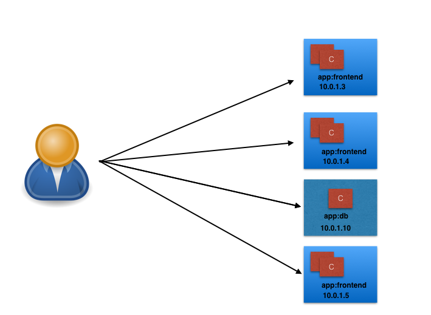
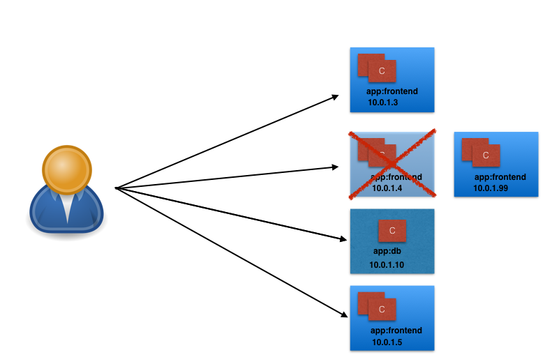
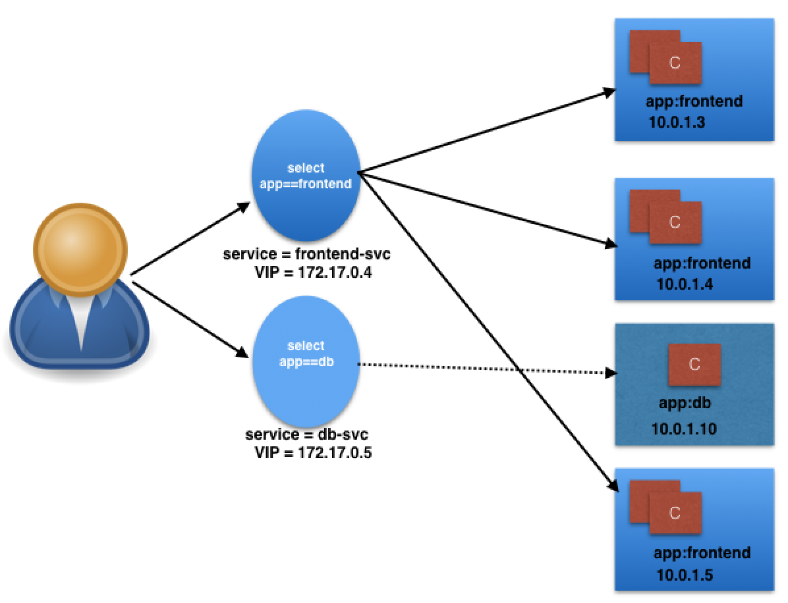
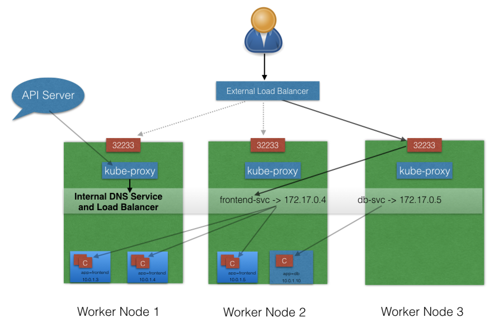
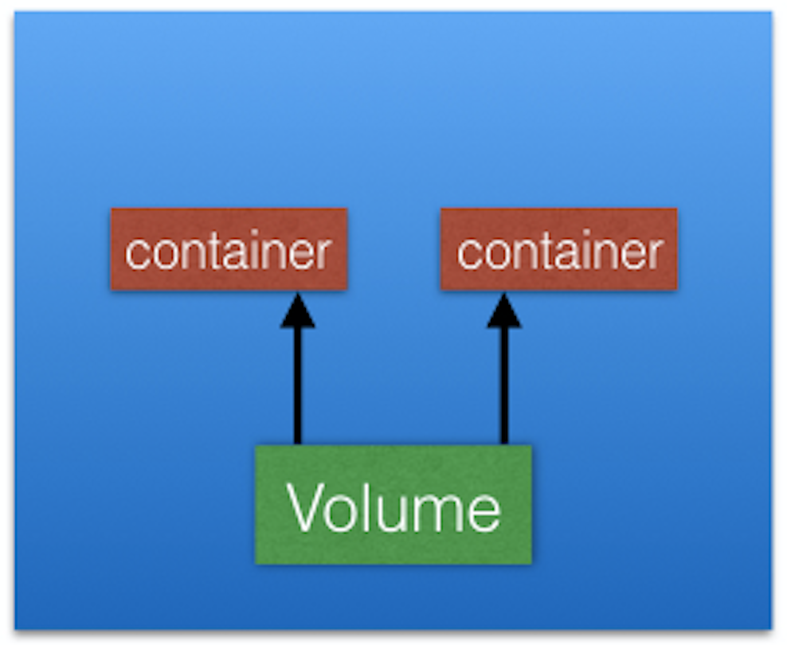

# Introduction to Kubernetes

<br>
<br>

## Basics | Terminology...

### Containers
are an application-centric way to deliver high-performing, scalable applications on the infrastructure of your choice.


### Images
With a **container image**, we bundle the application along with its runtime and dependencies. We use that image to create an isolated executable environment, also known as container. We can deploy containers from a given image on the platform of our choice, such as desktops, VMs, cloud, etc.

### Orchestration
In the **quality assurance (QA) environments**, we can get away with running containers on a single host to develop and test applications. However, when we go to production, we do not have the same liberty, as we need to ensure that our applications:
 
 - Are fault-tolerant
 - Can scale, and do this on-demand
 - Use resources optimally
 - Can discover other applications automatically, and communicate with each other
 - Are accessible from the external world 
 - Can update/rollback without any downtime. 

Container **orchestrators** are the tools which group hosts together to form a cluster, and help us fulfill the requirements mentioned above. 

Nowadays, there are many container orchestrators available, such as:

 - **Docker Swarm:** Docker Swarm is a container orchestrator provided by Docker, Inc. It is part of Docker Engine.
 - **Kubernetes:** Kubernetes was started by Google, but now, it is a part of the Cloud Native Computing Foundation project.
 - **Mesos Marathon:** Marathon is one of the frameworks to run containers at scale on Apache Mesos.
 - **Amazon ECS:** Amazon EC2 Container Service (ECS) is a hosted service provided by AWS to run Docker containers at scale on its infrastructrue.
 - **Hashicorp Nomad:** Nomad is the container orchestrator provided by HashiCorp.
 
#### Why Use Container Orchestrators?

Though we can argue that containers at scale can be maintained manually, or with the help of some scripts, container orchestrators can make things easy for operators.

Container orchestrators can:

 - Bring multiple hosts together and make them part of a cluster
 - Schedule containers to run on different hosts
 - Help containers running on one host reach out to containers running on other hosts in the cluster
 - Bind containers and storage
 - Bind containers of similar type to a higher-level construct, like services, so we don't have to deal with individual containers
 - Keep resource usage in-check, and optimize it when necessary
 - Allow secure access to applications running inside containers.

With all these built-in benefits, **it makes sense to use container orchestrators to manage containers**.

#### Where to Deploy Container Orchestrators?

Most container orchestrators can be deployed on the infrastructure of our choice. We can deploy them on bare metal, VMs, on-premise, or on a cloud of our choice. For example, Kubernetes can be deployed on our laptop/workstation, inside a company's datacenter, on AWS, on OpenStack, etc. There are even one-click installers available to set up Kubernetes on the cloud, like Google Kubernetes Engine on Google Cloud, or Azure Container Service on Microsoft Azure. Similar solutions are available for other container orchestrators, as well.

<br>
<br>
<br>
<br>
<br>
<br>

## Kubernetes Features I

Kubernetes offers a very rich set of features for container orchestration. Some of its fully supported features are:
 
 - **Automatic binpacking:** Kubernetes automatically schedules the containers based on resource usage and constraints, without sacrificing the availability.

- **Self-healing:** Kubernetes automatically replaces and reschedules the containers from failed nodes. It also kills and restarts the containers which do not respond to health checks, based on existing rules/policy.

 - **Horizontal scaling:** Kubernetes can automatically scale applications based on resource usage like CPU and memory. In some cases, it also supports dynamic scaling based on customer metrics.

 - **Service discovery and Load balancing:** Kubernetes groups sets of containers and refers to them via a Domain Name System (DNS). This DNS is also called a Kubernetes service. Kubernetes can discover these services automatically, and load-balance requests between containers of a given service.

## Kubernetes Features II

Some other fully supported Kubernetes features are:

- **Automated rollouts and rollbacks:** Kubernetes can roll out and roll back new versions/configurations of an application, without introducing any downtime.
- **Secrets and configuration management:** Kubernetes can manage secrets and configuration details for an application without re-building the respective images. With secrets, we can share confidential information to our application without exposing it to the stack configuration, like on GitHub.
- **Storage orchestration:** With Kubernetes and its plugins, we can automatically mount local, external, and storage solutions to the containers in a seamless manner, based on software-defined storage (SDS).
- **Batch execution:** Besides long running jobs, Kubernetes also supports batch execution.

There are many other features besides the ones we just mentioned, and they are currently in alpha/beta phase. They will add great value to any Kubernetes deployment once they become stable features. For example, support for role-based access control (RBAC) is  stable as of the Kubernetes 1.8 release.


<br>
<br>
<br>
<br>
<br>
<br>

## Worker Node Components

### Container Runtime

To run and manage a container's lifecycle, we need a container runtime on the worker node. Some examples of container runtimes are: 

 - containerd
 - rkt
 - lxd

Sometimes, Docker is also referred to as a container runtime, but to be precise, **Docker is a platform which uses *containerd*** as a container runtime. 

### kubelet

The kubelet is an agent which runs on each worker node and communicates with the master node. It receives the Pod definition via various means (primarily, through the API server), and runs the containers associated with the Pod. It also makes sure that the containers which are part of the Pods are healthy at all times.

The kubelet connects to the container runtime using **Container Runtime Interface (CRI)**. The Container Runtime Interface consists of protocol buffers, gRPC API, and libraries. 


As shown above, the kubelet (grpc client) connects to the CRI shim (grpc server) to perform container and image operations. CRI implements two services: `ImageService` and `RuntimeService`.

 - The `ImageService` is responsible for all the *image-related* operations, while
 - the `RuntimeService` is responsible for all the *Pod and container-related* operations.

> Container runtimes used to be hard-coded in Kubernetes, but with the development of CRI, Kubernetes can now use different container runtimes without the need to recompile. **Any container runtime that implements CRI can be used by Kubernetes to manage Pods, containers, and container images**.

### kube-proxy

Instead of connecting directly to Pods to access the applications, we use a logical construct called a **Service** as a connection endpoint. A Service groups related Pods and, when accessed, load balances to them. We will talk more about Services in later chapters.

**kube-proxy** is the network proxy which runs on each worker node and listens to the API server for each Service endpoint creation/deletion. For each Service endpoint, kube-proxy sets up the routes so that it can reach to it. We will also explore this in more detail in later chapters.

<br>
<br>
<br>
<br>
<br>
<br>

## Network Setup Challenges

To have a fully functional Kubernetes cluster, we need to make sure of the following:

 - A unique IP is assigned to each Pod
 - Containers in a Pod can communicate to each other
 - The Pod is able to communicate with other Pods in the cluster
 - If configured, the application deployed inside a Pod is accessible from the external world.

All of the above are networking challenges which must be addressed before deploying the Kubernetes cluster.

## Pod-to-Pod Communication Across Nodes

In a clustered environment, the Pods can be scheduled on any node. We need to make sure that the Pods can communicate across the nodes, and all the nodes should be able to reach any Pod. Kubernetes also puts a condition that there shouldn't be any Network Address Translation (NAT) while doing the Pod-to-Pod communication across hosts. We can achieve this via:
 
 - Routable Pods and nodes, using the underlying physical infrastructure, like Google Kubernetes Engine
 - Using Software Defined Networking, like Flannel, Weave, Calico, etc. 

<br>
<br>
<br>
<br>
<br>
<br>

## Kubernetes Configuration

Kubernetes can be installed using different configurations. The four major installation types are briefly presented below:

 - **All-in-One Single-Node Installation:** With all-in-one, all the master and worker components are installed on a single node. This is very useful for learning, development, and testing. This type should not be used in production. Minikube is one such example, and we are going to explore it in future chapters.
 
 - **Single-Node etcd, Single-Master, and Multi-Worker Installation:** In this setup, we have a single master node, which also runs a single-node etcd instance. Multiple worker nodes are connected to the master node.

 - **Single-Node etcd, Multi-Master, and Multi-Worker Installation:** In this setup, we have multiple master nodes, which work in an HA mode, but we have a single-node etcd instance.  Multiple worker nodes are connected to the master nodes.

 - **Multi-Node etcd, Multi-Master, and Multi-Worker Installation:** In this mode, etcd is configured in a clustered mode, outside the Kubernetes cluster, and the nodes connect to it. The master nodes are all configured in an HA mode, connecting to multiple worker nodes. This is the most advanced and recommended production setup.


<br>
<br>
<br>
<br>
<br>
<br>

## HTTP API Space of Kubernetes


HTTP API space of Kubernetes can be divided into three independent groups:

- **Core Group (`/api/v1`):** This group includes objects such as Pods, Services, nodes, etc.
- **Named Group:** This group includes objects in `/apis/$NAME/$VERSION` format. These different API versions imply different levels of stability and support:
    - *Alpha level* - it may be dropped at any point in time, without notice. For example, `/apis/batch/v2alpha1`.
    - *Beta level* - it is well-tested, but the semantics of objects may change in incompatible ways in a subsequent beta or stable release. For example, `/apis/certificates.k8s.io/v1beta1`.
    - *Stable level* - appears in released software for many subsequent versions. For example, /apis/networking.k8s.io/v1.
- **System-wide:** This group consists of system-wide API endpoints, like `/healthz`, `/logs`, `/metrics`, `/ui`, etc.

We can either connect to an API server directly via calling the respective API endpoints, or via the CLI/GUI.


<br>
<br>
<br>
<br>
<br>
<br>

## Kubernetes Building Blocks

### Pods

A Pod is the smallest and simplest Kubernetes object. It is the unit of deployment in Kubernetes, which represents a single instance of the application. A Pod is a logical collection of one or more containers, which:

 - Are scheduled together on the same host
 - Share the same network namespace
 - Mount the same external storage (volumes).


Pods are **ephemeral in nature**, and they do not have the capability to self-heal by themselves. That is why we use them with controllers, which can handle a Pod's replication, fault tolerance, self-heal, etc. Examples of controllers are Deployments, ReplicaSets, ReplicationControllers, etc. We attach the Pod's specification to other objects using Pods Templates, as we have seen in the previous section.

<br>
<br>
<br>
<br>
<br>
<br>

## Connecting Users to Pods

To access the application, a user/client needs to connect to the Pods. As Pods are ephemeral in nature, resources like IP addresses allocated to it cannot be static. Pods could die abruptly or be rescheduled based on existing requirements.

Let's take, for example, a scenario in which a user/client is connected to a Pod using its IP address.



**A Scenario Where a User Is Connected to a Pod via Its IP Address**

Unexpectedly, the Pod to which the user/client is connected dies, and a new Pod is created by the controller. The new Pod will have a new IP address, which will not be known automatically to the user/client of the earlier Pod.



**A New Pod Is Created After the Old One Dies Unexpectedly**

To overcome this situation, Kubernetes provides a higher-level abstraction called [Service](https://kubernetes.io/docs/concepts/services-networking/service/), which logically groups Pods and a policy to access them. This grouping is achieved via **Labels** and **Selectors**, which we talked about in the previous chapter.

<br>
<br>

## Services

For example, in the following graphical representation we have used the **app** keyword as a Label, and **frontend** and **db** as values for different Pods.


**Grouping of Pods using Labels and Selectors**

Using selectors (**app==frontend** and **app==db**), we can group them into two logical groups: one with 3 Pods, and one with just one Pod.

We can assign a name to the logical grouping, referred to as a **Service name**. In our example, we have created two Services, **frontend-svc** and **db-svc**, and they have the **app==frontend** and the **app==db** Selectors, respectively.


**Grouping of Pods using the Service object**

<br>
<br>

## Service Object Example


The following is an example of a Service object:

```
kind: Service
apiVersion: v1
metadata:
  name: frontend-svc
spec:
  selector:
    app: frontend
  ports:
    - protocol: TCP
      port: 80
      targetPort: 5000
```

In this example, we are creating a **frontend-svc** Service by selecting all the Pods that have the Label **app** set to the **frontend**. By default, each Service also gets an IP address, which is routable only inside the cluster. In our case, we have **172.17.0.4** and **172.17.0.5** IP addresses for our **frontend-svc** and **db-svc** Services, respectively. The IP address attached to each Service is also known as the ClusterIP for that Service.



**Accessing the Pods using Service Object**

The user/client now connects to a service via the IP address, which forwards the traffic to one of the Pods attached to it. A service does the load balancing while selecting the Pods for forwarding the data/traffic.

While forwarding the traffic from the Service, we can select the target port on the Pod. In our example, for **frontend-svc**, we will receive requests from the user/client on Port **80**. We will then forward these requests to one of the attached Pods on Port **5000**. If the target port is not defined explicitly, then traffic will be forwarded to Pods on the port on which the Service receives traffic.

A tuple of Pods, IP addresses, along with the targetPort is referred to as a **Service endpoint**. In our case, **frontend-svc** has 3 endpoints: **10.0.1.3:5000**, **10.0.1.4:5000**, and **10.0.1.5:5000**.


<br>
<br>
<br>
<br>
<br>
<br>

## kube-proxy

All of the worker nodes run a daemon called [kube-proxy](https://kubernetes.io/docs/concepts/services-networking/service/#virtual-ips-and-service-proxies), which watches the API server on the master node for the addition and removal of Services and endpoints. For each new Service, on each node, **kube-proxy** configures the iptables rules to capture the traffic for its ClusterIP and forwards it to one of the endpoints. When the service is removed, **kube-proxy** removes the iptables rules on all nodes as well.


**kube-proxy, Services, and Endpoints**


<br>
<br>
<br>
<br>
<br>
<br>

## Service Discovery

As Services are the primary mode of communication in Kubernetes, we need a way to discover them at runtime. Kubernetes supports two methods of discovering a Service:

-   **Environment Variables**\
    As soon as the Pod starts on any worker node, the **kubelet** daemon running on that node adds a set of environment variables in the Pod for all active Services. For example, if we have an active Service called **redis-master**, which exposes port **6379**, and its ClusterIP is **172.17.0.6**, then, on a newly created Pod, we can see the following environment variables:

        REDIS_MASTER_SERVICE_HOST=172.17.0.6
        REDIS_MASTER_SERVICE_PORT=6379
        REDIS_MASTER_PORT=tcp://172.17.0.6:6379
        REDIS_MASTER_PORT_6379_TCP=tcp://172.17.0.6:6379
        REDIS_MASTER_PORT_6379_TCP_PROTO=tcp
        REDIS_MASTER_PORT_6379_TCP_PORT=6379
        REDIS_MASTER_PORT_6379_TCP_ADDR=172.17.0.6

    With this solution, we need to be careful while ordering our Services, as the Pods will not have the environment variables set for Services which are created after the Pods are created.
-   **DNS**\
    Kubernetes has an [add-on](https://github.com/kubernetes/kubernetes/blob/master/cluster/addons/README.md) for [DNS](https://github.com/kubernetes/kubernetes/tree/master/cluster/addons/dns), which creates a DNS record for each Service and its format is like **my-svc.my-namespace.svc.cluster.local**.Services within the same Namespace can reach to other Services with just their name. For example, if we add a Service **redis-master** in the **my-ns** Namespace, then all the Pods in the same Namespace can reach to the **redis** Service just by using its name, **redis-master**. Pods from other Namespaces can reach the Service by adding the respective Namespace as a suffix, like **redis-master.my-ns**. 

This is the most common and highly recommended solution. For example, in the previous section's image, we have seen that an internal DNS is configured, which maps our Services **frontend-svc** and **db-svc** to **172.17.0.4** and **172.17.0.5**, respectively.


## ServiceType

While defining a Service, we can also choose its access scope. We can decide whether the Service:

-   Is only accessible within the cluster
-   Is accessible from within the cluster and the external world
-   Maps to an external entity which resides outside the cluster.

Access scope is decided by S*erviceType*, which can be mentioned when creating the Service.


## ServiceType: ClusterIP and NodePort

**ClusterIP** is the default *ServiceType*. A Service gets its Virtual IP address using the ClusterIP. That IP address is used for communicating with the Service and is accessible only within the cluster. 

With the **NodePort** *ServiceType*, in addition to creating a ClusterIP, a port from the range **30000-32767** is mapped to the respective Service, from all the worker nodes. For example, if the mapped NodePort is **32233** for the service **frontend-svc**, then, if we connect to any worker node on port **32233**, the node would redirect all the traffic to the assigned ClusterIP **- 172.17.0.4**.

By default, while exposing a NodePort, a random port is automatically selected by the Kubernetes Master from the port range **30000-32767**. If we don't want to assign a dynamic port value for NodePort, then, while creating the service, we can also give a port number from the earlier specific range. 


**NodePort**

The **NodePort** *ServiceType* is useful when we want to make our Services accessible from the external world. The end-user connects to the worker nodes on the specified port, which forwards the traffic to the applications running inside the cluster. To access the application from the external world, administrators can configure a reverse proxy outside the Kubernetes cluster and map the specific endpoint to the respective port on the worker nodes.


## ServiceType: LoadBalancer

With the **LoadBalancer** *ServiceType*:

-   NodePort and ClusterIP Services are automatically created, and the external load balancer will route to them
-   The Services are exposed at a static port on each worker node
-   The Service is exposed externally using the underlying cloud provider's load balancer feature.



**LoadBalancer**

The LoadBalancer *ServiceType* will only work if the underlying infrastructure supports the automatic creation of Load Balancers and have the respective support in Kubernetes, as is the case with the Google Cloud Platform and AWS.


## ServiceType: ExternalIP

A Service can be mapped to an **ExternalIP** address if it can route to one or more of the worker nodes. Traffic that is ingressed into the cluster with the ExternalIP (as destination IP) on the Service port, gets routed to one of the the Service endpoints.

 

**ExternalIP**

Please note that ExternalIPs are not managed by Kubernetes. The cluster administrators has configured the routing to map the ExternalIP address to one of the nodes.


## ServiceType: ExternalName

**ExternalName** is a special *ServiceType*, that has no Selectors and does not define any endpoints. When accessed within the cluster, it returns a **CNAME** record of an externally configured Service.

The primary use case of this *ServiceType* is to make externally configured Services like **my-database.example.com** available inside the cluster, using just the name, like **my-database**, to other Services inside the same Namespace.

<br>
<br>
<br>
<br>
<br>
<br>

## Liveness

If a container in the Pod is running, but the application running inside this container is not responding to our requests, then that container is of no use to us. This kind of situation can occur, for example, due to application deadlock or memory pressure. In such a case, it is recommended to restart the container to make the application available.

Rather than doing it manually, we can use **Liveness Probe**. Liveness probe checks on an application's health, and, if for some reason, the health check fails, it restarts the affected container automatically.

Liveness Probes can be set by defining:

-   Liveness command
-   Liveness HTTP request
-   TCP Liveness Probe.

We will discuss these three approaches in the next few sections.


## Liveness Command

In the following example, we are checking the existence of a file `/tmp/healthy`:

    apiVersion: v1
    kind: Pod
    metadata:
      labels:
        test: liveness
      name: liveness-exec
    spec:
      containers:
      - name: liveness
        image: k8s.gcr.io/busybox
        args:
        - /bin/sh
        - -c
        - touch /tmp/healthy; sleep 30; rm -rf /tmp/healthy; sleep 600
        livenessProbe:
          exec:
            command:
            - cat
            - /tmp/healthy
          initialDelaySeconds: 3
          periodSeconds: 5

The existence of the **/tmp/healthy** file is configured to be checked every 5 seconds using the **periodSeconds** parameter. The **initialDelaySeconds** parameter requests the kubelet to wait for 3 seconds before doing the first probe. When running the command line argument to the container, we will first create the **/tmp/healthy** file, and then we will remove it after 30 seconds. The deletion of the file would trigger a health failure, and our Pod would get restarted.

A demonstration video covering this topic is up next.

    /watch?v=Ila7OgC3eAY

## Liveness HTTP Request

In the following example, the kubelet sends the **HTTP GET** request to the **/healthz** endpoint of the application, on port **8080**. If that returns a failure, then the kubelet will restart the affected container; otherwise, it would consider the application to be alive.

    livenessProbe:
          httpGet:
            path: /healthz
            port: 8080
            httpHeaders:
            - name: X-Custom-Header
              value: Awesome
          initialDelaySeconds: 3
          periodSeconds: 3

## TCP Liveness Probe

With TCP Liveness Probe, the kubelet attempts to open the TCP Socket to the container which is running the application. If it succeeds, the application is considered healthy, otherwise the kubelet would mark it as unhealthy and restart the affected container.

    livenessProbe:
          tcpSocket:
            port: 8080
          initialDelaySeconds: 15
          periodSeconds: 20

## Readiness Probes

Sometimes, applications have to meet certain conditions before they can serve traffic. These conditions include ensuring that the depending service is ready, or acknowledging that a large dataset needs to be loaded, etc. In such cases, we use **Readiness Probes** and wait for a certain condition to occur. Only then, the application can serve traffic.

A Pod with containers that do not report ready status will not receive traffic from Kubernetes Services.

    readinessProbe:
      exec:
        command:
        - cat
        - /tmp/healthy
     initialDelaySeconds: 5
      periodSeconds: 5

Readiness Probes are configured similarly to Liveness Probes. Their configuration also remains the same.

<br>
<br>
<br>
<br>
<br>
<br>


## Volumes

As we know, containers, which create the Pods, are ephemeral in nature. All data stored inside a container is deleted if the container crashes. However, the kubelet will restart it with a clean state, which means that it will not have any of the old data.

To overcome this problem, Kubernetes uses [Volumes](https://kubernetes.io/docs/concepts/storage/volumes/). A Volume is essentially a directory backed by a storage medium. The storage medium and its content are determined by the Volume Type.



**Volumes**

In Kubernetes, a Volume is attached to a Pod and shared among the containers of that Pod. The Volume has the same life span as the Pod, and it outlives the containers of the Pod - this allows data to be preserved across container restarts.
