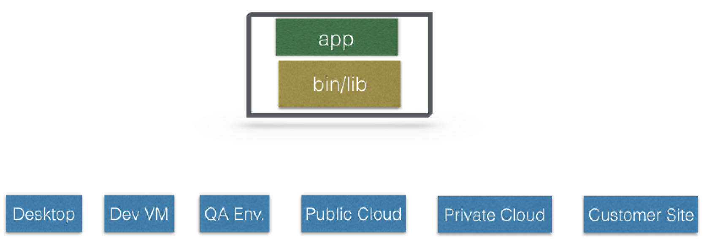

# Introduction to Kubernetes

 
 

## Basics | Terminology...

### Containers
are an application-centric way to deliver high-performing, scalable applications on the infrastructure of your choice.

### Images
With a **container image**, we bundle the application along with its runtime and dependencies. We use that image to create an isolated executable environment, also known as container. We can deploy containers from a given image on the platform of our choice, such as desktops, VMs, cloud, etc.

### Orchestration
In the **quality assurance (QA) environments**, we can get away with running containers on a single host to develop and test applications. However, when we go to production, we do not have the same liberty, as we need to ensure that our applications:
 
 - Are fault-tolerant
 - Can scale, and do this on-demand
 - Use resources optimally
 - Can discover other applications automatically, and communicate with each other
 - Are accessible from the external world 
 - Can update/rollback without any downtime. 

Container **orchestrators** are the tools which group hosts together to form a cluster, and help us fulfill the requirements mentioned above. 

Nowadays, there are many container orchestrators available, such as:

 - **Docker Swarm:** Docker Swarm is a container orchestrator provided by Docker, Inc. It is part of Docker Engine.
 - **Kubernetes:** Kubernetes was started by Google, but now, it is a part of the Cloud Native Computing Foundation project.
 - **Mesos Marathon:** Marathon is one of the frameworks to run containers at scale on Apache Mesos.
 - **Amazon ECS:** Amazon EC2 Container Service (ECS) is a hosted service provided by AWS to run Docker containers at scale on its infrastructrue.
 - **Hashicorp Nomad:** Nomad is the container orchestrator provided by HashiCorp.
 
#### Why Use Container Orchestrators?

Though we can argue that containers at scale can be maintained manually, or with the help of some scripts, container orchestrators can make things easy for operators.

Container orchestrators can:

 - Bring multiple hosts together and make them part of a cluster
 - Schedule containers to run on different hosts
 - Help containers running on one host reach out to containers running on other hosts in the cluster
 - Bind containers and storage
 - Bind containers of similar type to a higher-level construct, like services, so we don't have to deal with individual containers
 - Keep resource usage in-check, and optimize it when necessary
 - Allow secure access to applications running inside containers.

With all these built-in benefits, **it makes sense to use container orchestrators to manage containers**.

#### Where to Deploy Container Orchestrators?

Most container orchestrators can be deployed on the infrastructure of our choice. We can deploy them on bare metal, VMs, on-premise, or on a cloud of our choice. For example, Kubernetes can be deployed on our laptop/workstation, inside a company's datacenter, on AWS, on OpenStack, etc. There are even one-click installers available to set up Kubernetes on the cloud, like Google Kubernetes Engine on Google Cloud, or Azure Container Service on Microsoft Azure. Similar solutions are available for other container orchestrators, as well.

 
 
 
 
 
 

## Worker Node Components

### Container Runtime

To run and manage a container's lifecycle, we need a container runtime on the worker node. Some examples of container runtimes are: 

 - containerd
 - rkt
 - lxd

Sometimes, Docker is also referred to as a container runtime, but to be precise, **Docker is a platform which uses *containerd*** as a container runtime. 

### kubelet

The kubelet is an agent which runs on each worker node and communicates with the master node. It receives the Pod definition via various means (primarily, through the API server), and runs the containers associated with the Pod. It also makes sure that the containers which are part of the Pods are healthy at all times.

The kubelet connects to the container runtime using **Container Runtime Interface (CRI)**. The Container Runtime Interface consists of protocol buffers, gRPC API, and libraries. 

As shown above, the kubelet (grpc client) connects to the CRI shim (grpc server) to perform container and image operations. CRI implements two services: `ImageService` and `RuntimeService`.

 - The `ImageService` is responsible for all the *image-related* operations, while
 - the `RuntimeService` is responsible for all the *Pod and container-related* operations.

> Container runtimes used to be hard-coded in Kubernetes, but with the development of CRI, Kubernetes can now use different container runtimes without the need to recompile. **Any container runtime that implements CRI can be used by Kubernetes to manage Pods, containers, and container images**.

### kube-proxy

Instead of connecting directly to Pods to access the applications, we use a logical construct called a **Service** as a connection endpoint. A Service groups related Pods and, when accessed, load balances to them. We will talk more about Services in later chapters.

**kube-proxy** is the network proxy which runs on each worker node and listens to the API server for each Service endpoint creation/deletion. For each Service endpoint, kube-proxy sets up the routes so that it can reach to it. We will also explore this in more detail in later chapters.

 
 
 
 
 
 

## Network Setup Challenges

To have a fully functional Kubernetes cluster, we need to make sure of the following:

 - A unique IP is assigned to each Pod
 - Containers in a Pod can communicate to each other
 - The Pod is able to communicate with other Pods in the cluster
 - If configured, the application deployed inside a Pod is accessible from the external world.

All of the above are networking challenges which must be addressed before deploying the Kubernetes cluster.

## Pod-to-Pod Communication Across Nodes

In a clustered environment, the Pods can be scheduled on any node. We need to make sure that the Pods can communicate across the nodes, and all the nodes should be able to reach any Pod. Kubernetes also puts a condition that there shouldn't be any Network Address Translation (NAT) while doing the Pod-to-Pod communication across hosts. We can achieve this via:
 
 - Routable Pods and nodes, using the underlying physical infrastructure, like Google Kubernetes Engine
 - Using Software Defined Networking, like Flannel, Weave, Calico, etc. 

 
 
 
 
 
 

## Kubernetes Configuration

Kubernetes can be installed using different configurations. The four major installation types are briefly presented below:

 - **All-in-One Single-Node Installation:** With all-in-one, all the master and worker components are installed on a single node. This is very useful for learning, development, and testing. This type should not be used in production. Minikube is one such example, and we are going to explore it in future chapters.
 
 - **Single-Node etcd, Single-Master, and Multi-Worker Installation:** In this setup, we have a single master node, which also runs a single-node etcd instance. Multiple worker nodes are connected to the master node.

 - **Single-Node etcd, Multi-Master, and Multi-Worker Installation:** In this setup, we have multiple master nodes, which work in an HA mode, but we have a single-node etcd instance.  Multiple worker nodes are connected to the master nodes.

 - **Multi-Node etcd, Multi-Master, and Multi-Worker Installation:** In this mode, etcd is configured in a clustered mode, outside the Kubernetes cluster, and the nodes connect to it. The master nodes are all configured in an HA mode, connecting to multiple worker nodes. This is the most advanced and recommended production setup.
