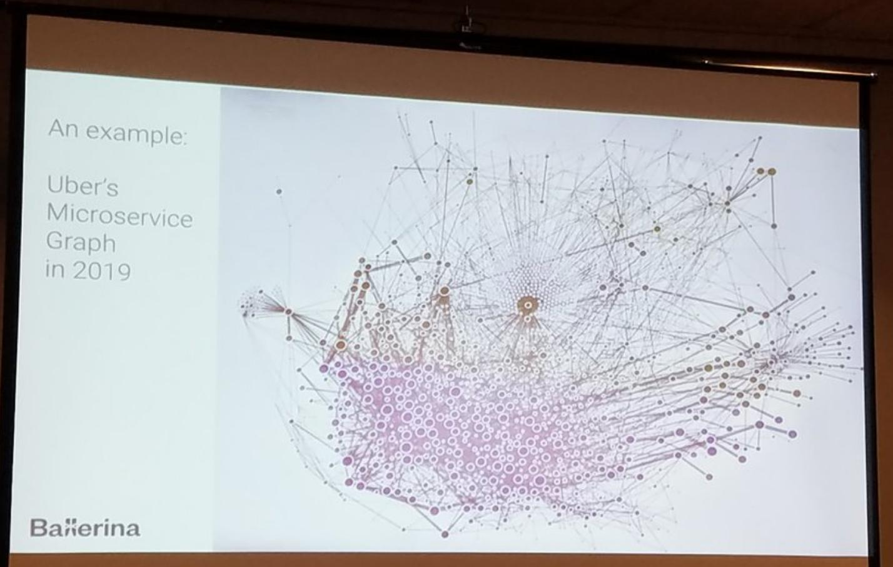

# complexity for velocity? (Sep 2019)
Microservices trade **complexity for velocity**. While achieving the latter is not guaranteed, the former always is! [tweet](https://twitter.com/bibryam/status/1172050320442241026)

# CPU burn (Sep 2019)
\- The thing that nobody talks about with the whole **sidecar pattern** is how much CPU it burns. If you're moving a lot of data in/out through the proxies it can be non-trivial. Adding 10-15% to your compute budget is a serious ask.

\- I dunno - folks using a sidecar often **tradeoff latency and efficiency for ... developer productivity**. That’s always how I’ve rationalized it.
[tweet/discussion](https://twitter.com/copyconstruct/status/1171646790610894849)

# ability to scale VS ability to be agile & survive (Jul 2019)
Forget that all these things exist: Microservices, Lambda, API Gateway, Containers, Kubernetes, Docker. Anything whose main value proposition is about **“ability to scale”** will likely trade off your **“ability to be agile & survive”**. That’s rarely a good trade off." [thread](https://twitter.com/dvassallo/status/1154516910265884672)

# Discussion (Jun 2019)
people: Michael Gasch, Christian Posta, William Louth, Karl Isenberg [Thread](https://twitter.com/embano1/status/1142188360192208896)

\- Service meshes provide a lot of value, especially around **encryption** and **observability**. I question, though, whether circuit breaking/timeouts/retries should be externalized (deferred) to the network.

...

\- It requires a **mature engineering organization** to develop standards and best practices, as well as complying with them, around the problem of reliability and correctness in distributed communication.

# A thread on "service meshes" and distributed system software complexity in general. Buckle up!
by Matt Klein

\- The backlash against service mesh, K8S, and other ☁️ native tech is based, reasonably IMO, on the view that vendor marketing and **big tech thought-leading are causing  smaller orgs to not see the forest for the trees and adopt solutions that are too complex** for their actual needs.

...

Focus on creating customer value and **keep things as simple and boring as possible for as long as possible**. BUT, if you are lucky enough to find success, your development team will grow, **you will end up moving to SoA**, and then the 💩 will hit the fan:

- Untyped languages and APIs won't feel so productive anymore.
- That monorepo? Don't even get me started.
- Today's state of the art FaaS is not going to cut it in terms of reliability, obs, networking, etc.
- **You WILL start feeling the SoA networking/obs pain.**

At this point, the "service mesh" is coming for you one way or the other because **the problems of obs, load balancing, service discovery, consistent timeouts, retries, etc. must be solved or your SoA is DOA.**

...

But remember, **VERY few companies get here. Make damn sure you need the networking complexity you are about to take on**, because no matter what the vendors/conferences tell you, there will be pain, and nothing comes for free.
