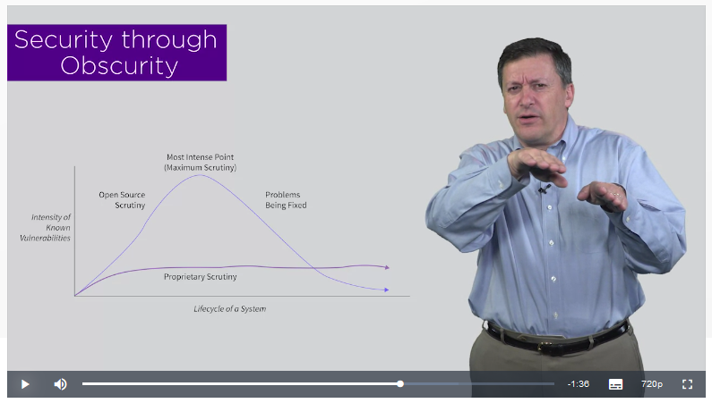

# Real-Time Cyber Threat Detection and Mitigation

 - **Created by**:  New York University Tandon School of Engineering
 - **Taught by**:  Dr. Edward G. Amoroso, Research Professor, NYU and CEO, TAG Cyber LLC
 - link: https://www.coursera.org/learn/real-time-cyber-threat-detection
 
## Security Through Obscurity

> So, in the cryptography community, security though obscurity means I'm going to make my cryptographic algorithm more secure by just not telling you what it is, and hoping that maybe you don't find out. Now, you can see how that's a terrible process, because in our world it seems like keeping secrets is almost impossible.

### Open-source Vs Proprietary

> You can see in the graph that if I have a piece of code that is in fact open source, then over time, once it's released, it's subjected to scrutiny, and you can see the intensity of known vulnerabilities will grow. Obviously as it's subjected to more scrutiny, you will find more vulnerabilities. So you're going to see a graph, in some sense, going up to some very intense point where perhaps you have maximum scrutiny on the code, and you've looked at through very thoroughly, the whole community, the whole world maybe. But what happens after that typically is that things start getting fixed at a more rapid pace than they're getting found. Do you follow? As you're finding vulnerabilities, yeah you're fixing them, but it's usually the case, [LAUGH] and with open search you find them so quickly, that you do see that intensity graph go up. But over time eventually things get better, like think Unix in the 70s, 80s, 90s, kind of was at its peak. Since then, Unix is by far the most robust, the most secure operating system that we have, because we've been staring at it for 50 years. So obviously you come way down the curve, and you see the benefits of all that scrutiny, and all that code review. Now, proprietary, in contrast, when it's released, and is secret, and you can't see the kernel, can't see see system code, you can't see source code, tends to see a much flatter sort of a known vulnerability intensity curve. It's flat, and it will stay flat because as long as you keep it hidden, then there's no reason to believe that you'd have a more intense period of scrutiny, unless somebody gets lucky for some reason, or something leaks. But if you keep it proprietary, then it'll stay the same. Now, what this suggests is that if the same piece of code made open source were made proprietary, and they started a different paths, you have a latent set of problems embedded in proprietary code that you haven't noticed yet, because nobody's noticed it, haven't looked at it. You follow? So the advantage of open source is eventually you get to a pretty good place. The disadvantage is it could be a bumpy ride. The advantage of proprietary is that over a life cycle there's a very good chance that you can stay just below some acceptability threshold, think Windows operating system, right?
