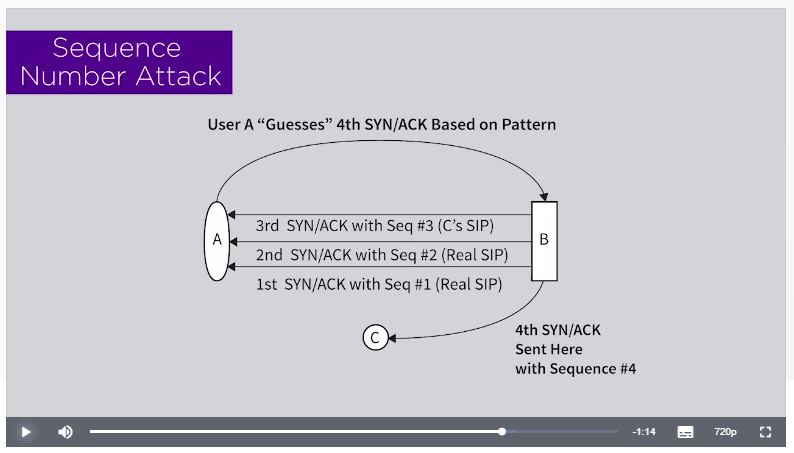
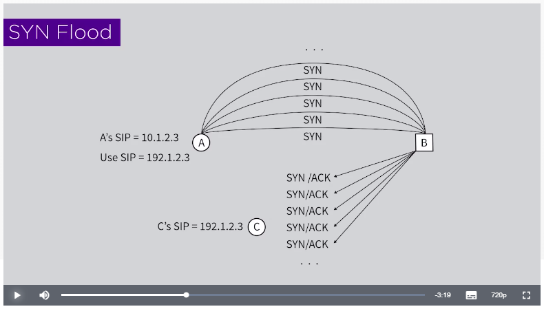
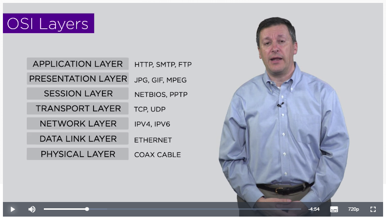

# Real-Time Cyber Threat Detection and Mitigation

 - **Created by**:  New York University Tandon School of Engineering
 - **Taught by**:  Dr. Edward G. Amoroso, Research Professor, NYU and CEO, TAG Cyber LLC
 - link: https://www.coursera.org/learn/real-time-cyber-threat-detection
 
## Security Through Obscurity

> So, in the cryptography community, security though obscurity means I'm going to make my cryptographic algorithm more secure by just not telling you what it is, and hoping that maybe you don't find out. Now, you can see how that's a terrible process, because in our world it seems like keeping secrets is almost impossible.

### Open-source Vs Proprietary

> You can see in the graph that if I have a piece of code that is in fact open source, then over time, once it's released, it's subjected to scrutiny, and you can see the intensity of known vulnerabilities will grow. Obviously as it's subjected to more scrutiny, you will find more vulnerabilities. So you're going to see a graph, in some sense, going up to some very intense point where perhaps you have maximum scrutiny on the code, and you've looked at through very thoroughly, the whole community, the whole world maybe. But what happens after that typically is that things start getting fixed at a more rapid pace than they're getting found. Do you follow? As you're finding vulnerabilities, yeah you're fixing them, but it's usually the case, [LAUGH] and with open search you find them so quickly, that you do see that intensity graph go up. But over time eventually things get better, like think Unix in the 70s, 80s, 90s, kind of was at its peak. Since then, Unix is by far the most robust, the most secure operating system that we have, because we've been staring at it for 50 years. So obviously you come way down the curve, and you see the benefits of all that scrutiny, and all that code review. Now, proprietary, in contrast, when it's released, and is secret, and you can't see the kernel, can't see see system code, you can't see source code, tends to see a much flatter sort of a known vulnerability intensity curve. It's flat, and it will stay flat because as long as you keep it hidden, then there's no reason to believe that you'd have a more intense period of scrutiny, unless somebody gets lucky for some reason, or something leaks. But if you keep it proprietary, then it'll stay the same. Now, what this suggests is that if the same piece of code made open source were made proprietary, and they started a different paths, you have a latent set of problems embedded in proprietary code that you haven't noticed yet, because nobody's noticed it, haven't looked at it. You follow? So the advantage of open source is eventually you get to a pretty good place. The disadvantage is it could be a **bumpy ride**. The advantage of proprietary is that over a life cycle there's a very good chance that you can stay just below some **acceptability threshold**, think Windows operating system, right?

## TCP/IP Evolution and Security

### Diversity

> Now there's a kind of a message here, this idea that diversity might actually be a good thing for security. It's not a good thing if you're a CIO, Chief Information Officer, for a company. You want low cost. You want everybody using the same tools. You want interoperability. You want non-diversity. They want to train everybody on the same thing.

**Although:**

>There's companies that do it like that. Like if you're here in the US, there's an airline called the Southwest Airline, and I'm pretty sure they run one type of aircraft, a Boeing 737 jet. And I always posit in my mind, what would happen if that got grounded? The whole company would be grounded. **That's a non-diverse business decision.** Now, it lowers their training cost, everybody flies the same stuff, everything's standard, I get that.

**But:**

> But from a security perspective, you the security engineer are going to have to think through as you're doing design. Is it better to have everything the same or to have some things different? That's going to be a decision you'll have to make as an engineer.

> **Advancing interoperability certainly does makes security more challenging**. I mean, it's a fact. It's one of those cases where infrastructure decisions are somewhat at odds with security decisions. You'll see as you continue in your studies of computer security that that's not always the case. For example, as we advance virtualization and cloud, which most Chief Information Security Officers and Chief Information Officers both like. So people who want to propose better computing with cloud and virtualization also are proposing things that are better for security, so it's not always the case that things are at odds. But with interoperability and security, we have to admit that **when we make it easier to do computing, we make it easier to do attacking**. So let's keep that in mind as we progress in our studies in cybersecurity.

## TCP/IP Overview

> 5 tuple (source/destination IPs & ports + protocol), Bob-Alice, 3-step handshake

## IP spoofing

> example in the '70s: "Steal this book",  swapping sender / recipient before sending a letter

## TCP Sequence Number Attack

> 1990s, Kevin Mitnick, Christmas Eve (low traffic)

Alice wants to start a session with Bob. She knows Bob and Bill trust each other so she does the following steps:

 - sends `SYN` packets to Bob and writes down the sequence numbers returned in the `SYN` `ACK`, let's say that 100, 200, 300..., 1000 were returned.
 - she has now a way to predict the next sequence number (1100), so
 - she sends a `SYN` and spoofs her IP to pretend that it was Bill who sent it
 - the server sends a `SYN` `ACK` to Bill
 - Alice `ACK`s back with sequence number: 1100. She's got the session set-up.

## Packet Flooding

**DDoS cases:**

 - Lie about IP address
     - `SYN` flood
 - Real IP address
     - Botnets

  

## Packet Sniffing

> Here's how the **protocol of Ethernet** was designed to work. An entity called a **frame** would be created. So different packet with layer two. The frame would be created.
> - It find its way out onto the wire, and it go to the first interface and say, "Hello, am I for you?" And whoever is at the other end would go, "No, no," whatever, but most part you'd say no. They would have an address. They would have and we call that a MAC address, and you'd say no.
> - So go to the next person. "Hey, am I for you?" You go, "Nope, not for me."
> - And it comes to me. Let's say I'm a security hacker, and I like to read everything, and I like to see everything. Comes to me, it doesn't have my address. It says, "Am I for you?" And I go, "Yeah you are for me. " I want everything. I say yes to everything. It's called **sniffing**.
